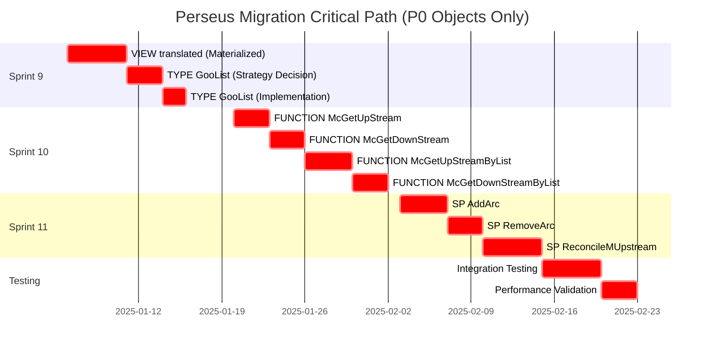
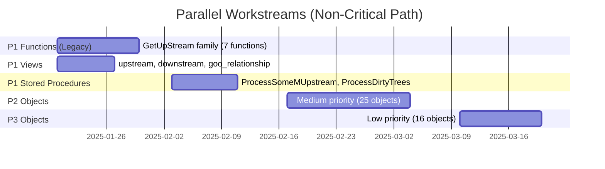
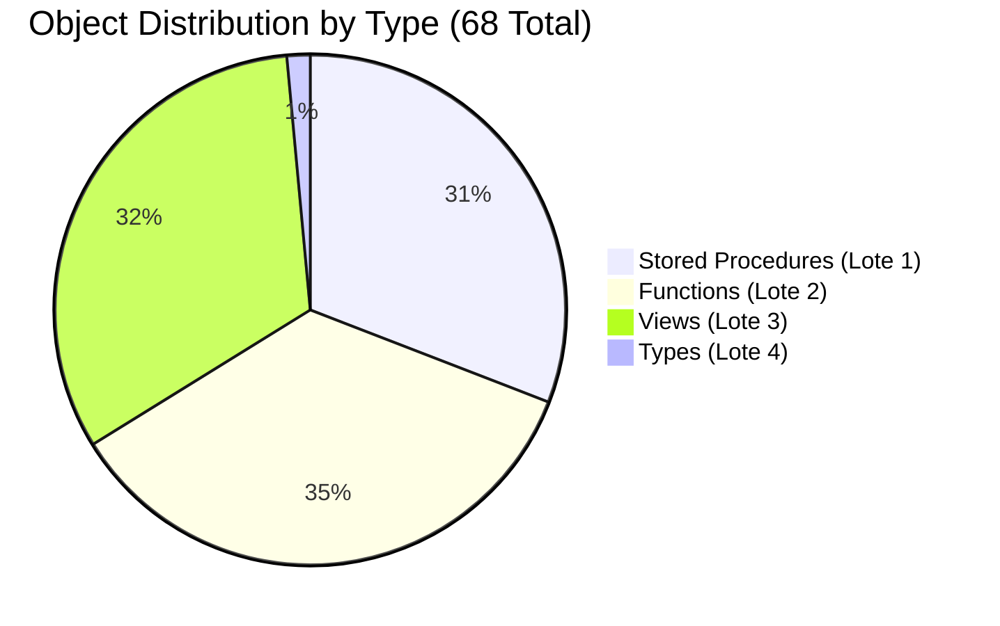
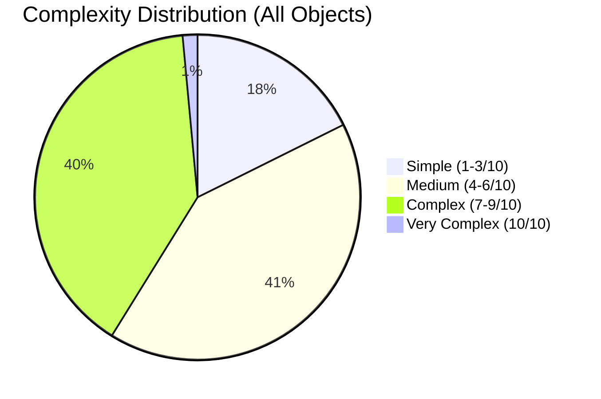
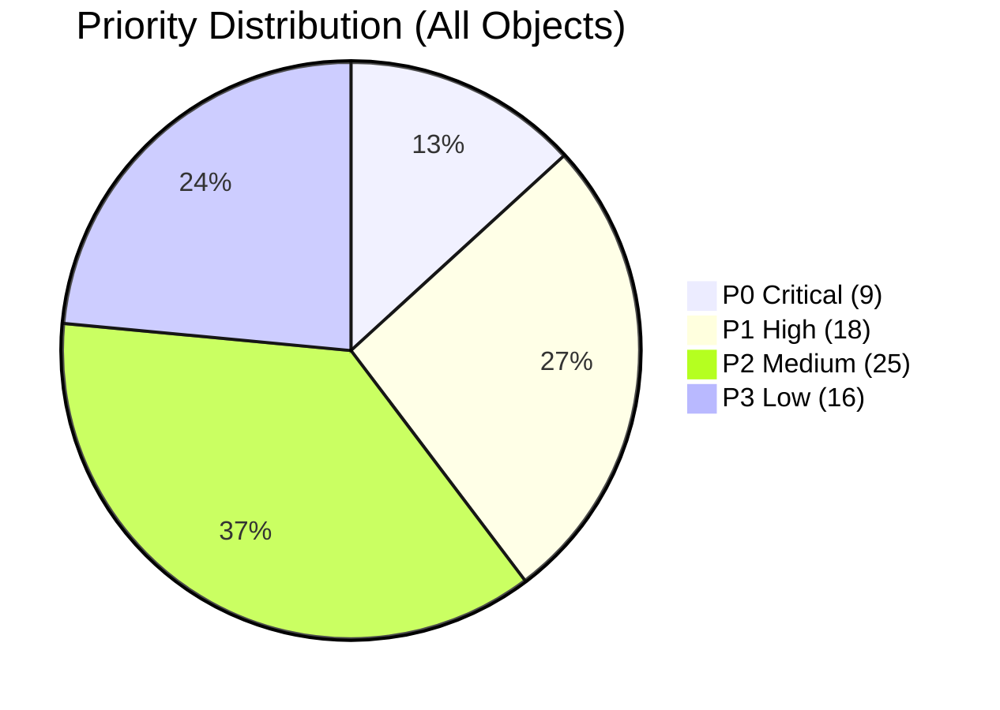

# 📊 Perseus Database Migration - Consolidated Dependency Analysis
## Complete Cross-Lote Integration & Visual Dependency Tree

**Analysis Date:** 2025-12-15  
**Analyst:** Pierre Ribeiro + Claude (Database Expert)  
**Project:** Perseus Database Migration - SQL Server → PostgreSQL 17  
**Repository:** pierreribeiro/sqlserver-to-postgresql-migration

---

## 🎯 Executive Summary

This consolidated document integrates the complete dependency analysis across all 4 lotes (batches), providing a holistic view of the Perseus database migration project. The analysis covers **68 database objects** spanning stored procedures, functions, views, and types.

### Analysis Coverage

| Lote | Category | Objects Analyzed | Critical Objects | Document |
|------|----------|------------------|------------------|----------|
| **Lote 1** | Stored Procedures | 21 | 3 P0 (AddArc, RemoveArc, ReconcileMUpstream) | [dependency-analysis-lote1-stored-procedures.md](dependency-analysis-lote1-stored-procedures.md) |
| **Lote 2** | Functions | 24 | 4 P0 (McGet* family) | [dependency-analysis-lote2-functions.md](dependency-analysis-lote2-functions.md) |
| **Lote 3** | Views | 22 | 1 P0 (translated - INDEXED VIEW) | [dependency-analysis-lote3-views.md](dependency-analysis-lote3-views.md) |
| **Lote 4** | Types | 1 | 1 P0 (GooList - TVP) | [dependency-analysis-lote4-types.md](dependency-analysis-lote4-types.md) |
| **TOTAL** | All Objects | **68** | **9 P0** | This document |

### Critical Discovery Summary

**THE CRITICAL PATH (P0 Objects):**

```
┌─────────────────────────────────────────────────────────────┐
│                    APPLICATION / UI LAYER                    │
└────────────────────────┬────────────────────────────────────┘
                         │
                         ▼
┌─────────────────────────────────────────────────────────────┐
│  STORED PROCEDURES (Lote 1) - 3 P0 Objects                  │
│  • AddArc                    ⭐⭐⭐ Material lineage creation│
│  • RemoveArc                 ⭐⭐⭐ Material lineage deletion│
│  • ReconcileMUpstream        ⭐⭐⭐ Batch reconciliation    │
└────────────────────────┬────────────────────────────────────┘
                         │
                         ▼
┌─────────────────────────────────────────────────────────────┐
│  FUNCTIONS (Lote 2) - 4 P0 Objects                          │
│  • McGetUpStream()           ⭐⭐⭐ Single material upstream │
│  • McGetDownStream()         ⭐⭐⭐ Single material downstream│
│  • McGetUpStreamByList()     ⭐⭐⭐ Batch upstream (GooList) │
│  • McGetDownStreamByList()   ⭐⭐ Batch downstream (GooList) │
└────────────────────────┬────────────────────────────────────┘
                         │
                         ▼
┌─────────────────────────────────────────────────────────────┐
│  VIEWS (Lote 3) - 1 P0 Object                               │
│  • translated               ⭐⭐⭐⭐ INDEXED VIEW (CRITICAL) │
│    └─> MATERIALIZED VIEW required in PostgreSQL             │
│    └─> Performance: 10-100x speedup vs regular view         │
└────────────────────────┬────────────────────────────────────┘
                         │
                         ▼
┌─────────────────────────────────────────────────────────────┐
│  TYPES (Lote 4) - 1 P0 Object                               │
│  • GooList                  ⭐⭐⭐⭐ Table-Valued Parameter  │
│    └─> No PostgreSQL native equivalent                      │
│    └─> Recommended: TEMPORARY TABLE pattern                 │
└────────────────────────┬────────────────────────────────────┘
                         │
                         ▼
┌─────────────────────────────────────────────────────────────┐
│  BASE TABLES (Foundation)                                    │
│  • material_transition      ⭐⭐⭐⭐ Parent→Transition edges │
│  • transition_material      ⭐⭐⭐⭐ Transition→Child edges  │
│  • goo                      ⭐⭐⭐ Material master table     │
│  • m_upstream               ⭐⭐⭐ Cached upstream graph     │
│  • m_downstream             ⭐⭐⭐ Cached downstream graph   │
└─────────────────────────────────────────────────────────────┘
```

---

## 🗺️ VISUAL DEPENDENCY TREE - COMPLETE GRAPH

### Primary Dependency Graph (P0 Critical Path)

```mermaid
graph TB
    subgraph APP["🖥️ APPLICATION LAYER"]
        UI[Application/UI]
        JOBS[Scheduled Jobs]
    end
    
    subgraph SP["📋 STORED PROCEDURES - Lote 1"]
        AddArc["AddArc<br/>⭐⭐⭐ P0<br/>Complexity: 9/10"]
        RemoveArc["RemoveArc<br/>⭐⭐⭐ P0<br/>Complexity: 8/10"]
        ReconcileMUpstream["ReconcileMUpstream<br/>⭐⭐⭐ P0<br/>Complexity: 9/10"]
        ProcessSomeMUpstream["ProcessSomeMUpstream<br/>⭐⭐ P1<br/>Complexity: 8/10"]
    end
    
    subgraph FUNC["⚙️ FUNCTIONS - Lote 2"]
        McGetUpStream["McGetUpStream()<br/>⭐⭐⭐ P0<br/>Recursive CTE"]
        McGetDownStream["McGetDownStream()<br/>⭐⭐⭐ P0<br/>Recursive CTE"]
        McGetUpStreamByList["McGetUpStreamByList()<br/>⭐⭐⭐ P0<br/>Batch Processing"]
        McGetDownStreamByList["McGetDownStreamByList()<br/>⭐⭐ P1<br/>Batch Processing"]
    end
    
    subgraph VIEW["👁️ VIEWS - Lote 3"]
        translated["translated<br/>⭐⭐⭐⭐ P0 CRITICAL<br/>INDEXED VIEW<br/>WITH SCHEMABINDING"]
        upstream["upstream<br/>⭐⭐ HIGH<br/>Recursive CTE"]
        downstream["downstream<br/>⭐⭐ HIGH<br/>Recursive CTE"]
    end
    
    subgraph TYPE["🔷 TYPES - Lote 4"]
        GooList["GooList<br/>⭐⭐⭐⭐ P0 CRITICAL<br/>Table-Valued Parameter<br/>PRIMARY KEY CLUSTERED"]
    end
    
    subgraph TABLES["🗄️ BASE TABLES"]
        mat_trans["material_transition<br/>⭐⭐⭐⭐"]
        trans_mat["transition_material<br/>⭐⭐⭐⭐"]
        goo["goo<br/>⭐⭐⭐"]
        m_up["m_upstream<br/>⭐⭐⭐"]
        m_down["m_downstream<br/>⭐⭐⭐"]
    end
    
    %% Application to SP connections
    UI -->|calls| AddArc
    UI -->|calls| RemoveArc
    JOBS -->|scheduled| ReconcileMUpstream
    
    %% SP to Function connections
    AddArc -->|calls| McGetUpStream
    AddArc -->|calls| McGetDownStream
    RemoveArc -->|calls| McGetUpStream
    RemoveArc -->|calls| McGetDownStream
    ReconcileMUpstream -->|calls| McGetUpStreamByList
    ProcessSomeMUpstream -->|calls| McGetUpStreamByList
    
    %% Function to Type connections
    McGetUpStreamByList -->|uses| GooList
    McGetDownStreamByList -->|uses| GooList
    ReconcileMUpstream -->|declares| GooList
    ProcessSomeMUpstream -->|declares| GooList
    
    %% Function to View connections
    McGetUpStream -->|queries| translated
    McGetDownStream -->|queries| translated
    McGetUpStreamByList -->|queries| translated
    McGetDownStreamByList -->|queries| translated
    upstream -->|queries| translated
    downstream -->|queries| translated
    
    %% View to Table connections
    translated -->|joins| mat_trans
    translated -->|joins| trans_mat
    
    %% SP to Table connections
    ReconcileMUpstream -->|reads/writes| m_up
    AddArc -->|reads/writes| m_up
    AddArc -->|reads/writes| m_down
    RemoveArc -->|reads/writes| m_up
    RemoveArc -->|reads/writes| m_down
    
    %% Additional table connections
    McGetUpStreamByList -->|validates| goo
    
    %% Styling
    classDef criticalPath fill:#ff6b6b,stroke:#c92a2a,stroke-width:3px,color:#fff
    classDef highPriority fill:#ffd93d,stroke:#f59f00,stroke-width:2px
    classDef mediumPriority fill:#6bcf7f,stroke:#2f9e44,stroke-width:2px
    classDef foundationLayer fill:#748ffc,stroke:#5c7cfa,stroke-width:2px
    
    class AddArc,RemoveArc,ReconcileMUpstream,McGetUpStream,McGetDownStream,McGetUpStreamByList,translated,GooList criticalPath
    class ProcessSomeMUpstream,McGetDownStreamByList,upstream,downstream highPriority
    class mat_trans,trans_mat,goo,m_up,m_down foundationLayer
```



### Secondary Dependencies Graph (Legacy & Support Objects)

```mermaid
graph TB
    subgraph LEGACY["📜 LEGACY FUNCTIONS - Get* Family"]
        GetUpStream["GetUpStream()<br/>⭐⭐ HIGH<br/>Nested Sets"]
        GetDownStream["GetDownStream()<br/>⭐⭐ HIGH<br/>Nested Sets"]
        GetUpStreamFamily["GetUpStreamFamily()<br/>⭐ MEDIUM"]
        GetDownStreamFamily["GetDownStreamFamily()<br/>⭐ MEDIUM"]
    end
    
    subgraph SUPPORT["🔧 SUPPORT VIEWS"]
        goo_relationship["goo_relationship<br/>⭐⭐ HIGH<br/>3-way UNION"]
        hermes_run["hermes_run<br/>⭐ MEDIUM<br/>Cross-schema"]
        vw_lot["vw_lot<br/>⭐ MEDIUM<br/>Business entity"]
    end
    
    subgraph TABLES2["🗄️ SUPPORT TABLES"]
        goo_rel_table["goo (nested sets)<br/>tree_left_key<br/>tree_right_key"]
        fatsmurf["fatsmurf<br/>Process/Experiment"]
        hermes_run_table["hermes.run<br/>Cross-schema"]
    end
    
    %% Legacy function dependencies
    GetUpStream -->|queries| goo_rel_table
    GetUpStream -->|queries| goo_relationship
    GetDownStream -->|queries| goo_rel_table
    GetDownStream -->|queries| goo_relationship
    GetUpStreamFamily -->|calls| GetUpStream
    GetDownStreamFamily -->|calls| GetDownStream
    
    %% Support view dependencies
    goo_relationship -->|unions| goo_rel_table
    goo_relationship -->|unions| fatsmurf
    goo_relationship -->|unions| hermes_run_table
    hermes_run -->|joins| goo_rel_table
    hermes_run -->|joins| hermes_run_table
    vw_lot -->|joins| goo_rel_table
    vw_lot -->|joins| fatsmurf
    
    classDef legacy fill:#adb5bd,stroke:#868e96,stroke-width:2px
    classDef support fill:#96f2d7,stroke:#12b886,stroke-width:2px
    
    class GetUpStream,GetDownStream,GetUpStreamFamily,GetDownStreamFamily legacy
    class goo_relationship,hermes_run,vw_lot support
```



---

## 📊 MASTER PRIORITY MATRIX - ALL 68 OBJECTS

### Priority Distribution Summary

| Priority | Count | Percentage | Migration Timeline |
|----------|-------|------------|-------------------|
| **P0 - ABSOLUTE CRITICAL** | 9 | 13.2% | Sprint 9-10 (2-3 weeks) |
| **P1 - HIGH** | 18 | 26.5% | Sprint 10-12 (4-6 weeks) |
| **P2 - MEDIUM** | 25 | 36.8% | Sprint 12-14 (4-6 weeks) |
| **P3 - LOW** | 16 | 23.5% | Sprint 14-15 (2-3 weeks) |
| **TOTAL** | **68** | **100%** | **12-18 weeks total** |

### P0 - ABSOLUTE CRITICAL (9 objects) ⭐⭐⭐⭐

**MUST complete BEFORE any other migrations. These form the critical path.**

| # | Object | Type | Lote | Complexity | Business Impact | Blocks |
|---|--------|------|------|------------|-----------------|--------|
| 1 | **translated** | View (INDEXED) | 3 | 8/10 | CRITICAL - 10-100x perf | 4 P0 functions |
| 2 | **GooList** | Type (TVP) | 4 | 5/10 | CRITICAL - Batch ops | 4 P0/P1 objects |
| 3 | **McGetUpStream** | Function | 2 | 8/10 | CRITICAL - Single lineage | AddArc, RemoveArc |
| 4 | **McGetDownStream** | Function | 2 | 8/10 | CRITICAL - Single lineage | AddArc, RemoveArc |
| 5 | **McGetUpStreamByList** | Function | 2 | 9/10 | CRITICAL - Batch lineage | ReconcileMUpstream |
| 6 | **AddArc** | SP | 1 | 9/10 | CRITICAL - Create lineage | Applications |
| 7 | **RemoveArc** | SP | 1 | 8/10 | CRITICAL - Delete lineage | Applications |
| 8 | **ReconcileMUpstream** | SP | 1 | 9/10 | CRITICAL - Reconciliation | Scheduled jobs |
| 9 | **McGetDownStreamByList** | Function | 2 | 8/10 | HIGH - Batch downstream | Future batch ops |

**Migration Order (STRICT):**
1. VIEW `translated` (MATERIALIZED VIEW + triggers)
2. TYPE `GooList` (TEMP TABLE pattern decision)
3. FUNCTIONS McGet* family (4 functions)
4. STORED PROCEDURES (3 SPs)

**Gate Criteria:**
- ✅ All P0 objects must pass performance testing
- ✅ Results must match SQL Server output 100%
- ✅ Performance within 20% of SQL Server baseline
- ✅ Zero data loss in lineage calculations

---

### P1 - HIGH PRIORITY (18 objects) ⭐⭐

**Critical for full system operation. High usage frequency.**

#### Stored Procedures (Lote 1) - 5 objects

| Object | Complexity | Business Impact | Key Dependencies |
|--------|------------|-----------------|------------------|
| ProcessSomeMUpstream | 8/10 | HIGH - Batch processor | McGetUpStreamByList, GooList |
| ProcessDirtyTrees | 8/10 | HIGH - Tree maintenance | GetUpStream family |
| MoveContainer | 7/10 | HIGH - Inventory mgmt | sp_move_node |
| MoveGooType | 6/10 | MEDIUM - Type management | goo table |
| GetMaterialByRunProperties | 5/10 | MEDIUM - Search/query | hermes.run |

#### Functions (Lote 2) - 7 objects

| Object | Complexity | Business Impact | Key Dependencies |
|--------|------------|-----------------|------------------|
| GetUpStream | 7/10 | HIGH - Legacy upstream | goo nested sets, goo_relationship |
| GetDownStream | 7/10 | HIGH - Legacy downstream | goo nested sets, goo_relationship |
| GetUpStreamFamily | 6/10 | MEDIUM - Extended upstream | GetUpStream |
| GetDownStreamFamily | 6/10 | MEDIUM - Extended downstream | GetDownStream |
| GetUpStreamContainers | 6/10 | MEDIUM - Container filter | goo, container |
| GetDownStreamContainers | 6/10 | MEDIUM - Container filter | goo, container |
| GetUnProcessedUpStream | 5/10 | MEDIUM - Status filter | goo |

#### Views (Lote 3) - 3 objects

| Object | Complexity | Business Impact | Key Dependencies |
|--------|------------|-----------------|------------------|
| upstream | 7/10 | HIGH - All upstream paths | translated (materialized) |
| downstream | 7/10 | HIGH - All downstream paths | translated (materialized) |
| goo_relationship | 6/10 | HIGH - Explicit relationships | goo, fatsmurf, hermes.run |

#### Integration Objects - 3 objects

| Object | Complexity | Business Impact | Key Dependencies |
|--------|------------|-----------------|------------------|
| hermes_run | 6/10 | MEDIUM - Experiment integration | hermes.run, goo, container |
| LinkUnlinkedMaterials | 5/10 | MEDIUM - Data cleanup | material_transition, transition_material |
| MaterialToTransition | 2/10 | LOW - Simple helper | material_transition |

**Timeline:** Sprint 10-12 (4-6 weeks)

---

### P2 - MEDIUM PRIORITY (25 objects) ⭐

**Important for business operations but not blocking critical path.**

#### Stored Procedures (Lote 1) - 7 objects

- usp_UpdateMUpstream (6/10) - Manual maintenance
- usp_UpdateMDownstream (6/10) - Manual maintenance  
- usp_UpdateContainerTypeFromArgus (5/10) - External integration
- TransitionToMaterial (2/10) - Simple helper
- sp_move_node (7/10) - Node management
- 6x sp_MS* replication procedures (2/10 each) - May not be needed

#### Functions (Lote 2) - 8 objects

- GetUpstreamMasses (9/10) - CURSOR refactoring required
- GetReadCombos (7/10) - Robot automation
- GetTransferCombos (7/10) - Robot automation
- GetSampleTime (8/10) - Lab systems
- GetFermentationFatSmurf (5/10) - Fermentation module
- McGetUpDownStream (4/10) - Combined traversal
- Get*Experiment/Hermes/Run functions (3-4/10 each) - ID extraction

#### Views (Lote 3) - 10 objects

- material_transition_material (5/10) - Flattened relationships
- vw_lot (5/10) - Business entity
- vw_lot_edge (5/10) - Lot tracking
- vw_lot_path (7/10) - Lot paths
- vw_material_transition_material_up (4/10) - Upstream relationships
- vw_fermentation_upstream (6/10) - Fermentation lineage
- vw_process_upstream (6/10) - Process lineage
- vw_processable_logs (6/10) - Robot logs
- vw_recipe_prep (5/10) - Recipe preparation
- vw_recipe_prep_part (4/10) - Recipe parts

**Timeline:** Sprint 12-14 (4-6 weeks)

---

### P3 - LOW PRIORITY (16 objects) ⭐

**Utility functions and deprecated/optional objects.**

#### Functions (Lote 2) - 4 objects

- ReversePath (3/10) - String utility
- RoundDateTime (2/10) - Date utility
- initCaps (3/10) - String formatting (use PostgreSQL initcap())
- udf_datetrunc (2/10) - Date truncation (use PostgreSQL date_trunc())

#### Views (Lote 3) - 6 objects

- combined_field_map (4/10) - Field mapping
- combined_field_map_block (4/10) - Field blocks
- combined_field_map_display_type (4/10) - Display types
- combined_sp_field_map (5/10) - SP-generated fields
- combined_sp_field_map_display_type (5/10) - SP display types

#### Custom/User-Specific Views - 6 objects

- vw_jeremy_runs (5/10) - User-specific (deprecation candidate)
- vw_tom_perseus_sample_prep_materials (6/10) - User-specific (deprecation candidate)
- Other custom views (4-5/10 each) - Review with stakeholders

**Timeline:** Sprint 14-15 (2-3 weeks)

---

## 🎯 CRITICAL PATH ANALYSIS

### The Single Critical Path (P0 Only)

**This path MUST be completed in sequence. No parallelization possible.**



**Total Critical Path Duration:** 43 days (~9 weeks)

**Bottlenecks:**
1. **VIEW `translated`** - MUST be completed first (5 days)
2. **TYPE `GooList`** - Strategy decision critical (3 days decision + 2 days impl)
3. **FUNCTION McGetUpStreamByList** - Most complex function (4 days)
4. **SP ReconcileMUpstream** - Most complex SP (5 days)

**Risks:**
- VIEW `translated` refresh strategy delays
- GooList conversion strategy decision paralysis
- Performance testing reveals issues requiring redesign

---

### Parallelization Opportunities (P1/P2/P3)

**While P0 is blocked, these can proceed in parallel:**



---

## 🔥 RISK ASSESSMENT MATRIX

### Critical Risks (High Impact, High Probability)

| Risk | Impact | Probability | Mitigation Strategy | Owner |
|------|--------|-------------|---------------------|-------|
| **VIEW `translated` performance degradation** | 🔴 CRITICAL | 🟡 MEDIUM | Trigger-based refresh + extensive testing with production data | DBA Team |
| **GooList conversion strategy incorrect** | 🔴 CRITICAL | 🟡 MEDIUM | Prototype all 3 options, benchmark with real batch sizes | Development Team |
| **Recursive CTE performance issues** | 🔴 HIGH | 🟡 MEDIUM | work_mem tuning, consider materialized views for upstream/downstream | DBA Team |
| **Data loss in lineage calculations** | 🔴 CRITICAL | 🟢 LOW | Comprehensive testing, diff SQL Server vs PostgreSQL results | QA Team |

### High Risks (High Impact, Lower Probability)

| Risk | Impact | Probability | Mitigation Strategy | Owner |
|------|--------|-------------|---------------------|-------|
| **McGet* functions incorrect results** | 🔴 HIGH | 🟢 LOW | Unit tests with known material graphs, validate all edge cases | Development Team |
| **RemoveArc commented logic issues** | 🟠 MEDIUM | 🟡 MEDIUM | Investigate commented code, decide restore vs keep commented | Business Analyst |
| **Hermes schema not available** | 🟠 MEDIUM | 🟡 MEDIUM | Coordinate migration timing, ensure hermes schema migrated first | Project Manager |
| **Linked server (Argus) integration** | 🟠 MEDIUM | 🟠 HIGH | Early FDW/dblink testing, fallback to API integration | Integration Team |

### Medium Risks (Medium Impact, Various Probabilities)

| Risk | Impact | Probability | Mitigation Strategy | Owner |
|------|--------|-------------|---------------------|-------|
| **Cursor refactoring (GetUpstreamMasses)** | 🟡 MEDIUM | 🟠 HIGH | Set-based refactoring, extensive testing of mass calculations | Development Team |
| **Nested sets model issues** | 🟡 MEDIUM | 🟢 LOW | PostgreSQL supports nested sets natively, low risk | DBA Team |
| **Collation differences** | 🟡 MEDIUM | 🟡 MEDIUM | Test case sensitivity, adjust WHERE clauses if needed | QA Team |
| **NVARCHAR to VARCHAR data loss** | 🟡 MEDIUM | 🟢 LOW | PostgreSQL UTF-8 by default, test international characters | QA Team |

### Low Risks (Low Impact or Low Probability)

| Risk | Impact | Probability | Mitigation Strategy | Owner |
|------|--------|-------------|---------------------|-------|
| **Utility function migration** | 🟢 LOW | 🟢 LOW | Use PostgreSQL built-ins where possible | Development Team |
| **Deprecated views (user-specific)** | 🟢 LOW | 🟡 MEDIUM | Audit with stakeholders, document deprecation | Business Analyst |
| **Combined views (field_map)** | 🟢 LOW | 🟢 LOW | UNION views supported natively | Development Team |

**Legend:**
- 🔴 CRITICAL: Migration blocker
- 🟠 HIGH: Significant delay risk
- 🟡 MEDIUM: Moderate impact
- 🟢 LOW: Minimal impact

---

## 🗓️ INTEGRATED MIGRATION ROADMAP

### Phase 1: Foundation Layer (Sprint 9) - 2 weeks

**Goal:** Establish critical foundation (VIEW, TYPE)

**Week 1:**
- Day 1-2: Design `translated` materialized view refresh strategy
- Day 3-5: Implement + test `translated` materialized view
- Gate: Performance test with production data scale

**Week 2:**
- Day 1-3: GooList conversion strategy decision (prototype 3 options)
- Day 4-5: Implement chosen strategy (TEMP TABLE recommended)
- Gate: Proof-of-concept with 10 UIDs validated

**Deliverables:**
- ✅ `translated` materialized view with trigger refresh
- ✅ GooList TEMP TABLE implementation
- ✅ Performance benchmarks documented

**Blockers Removed:**
- 🔓 All P0 functions can now proceed
- 🔓 upstream/downstream views can proceed

---

### Phase 2: Core Functions (Sprint 10) - 2 weeks

**Goal:** Migrate all McGet* family functions

**Week 1:**
- Day 1-3: McGetUpStream + McGetDownStream functions
- Day 4-5: Unit testing with known material graphs

**Week 2:**
- Day 1-4: McGetUpStreamByList + McGetDownStreamByList (GooList integration)
- Day 5: Integration testing with VIEW translated

**Deliverables:**
- ✅ 4 McGet* functions migrated
- ✅ Unit tests passing (100+ test cases)
- ✅ Performance within 20% of SQL Server

**Blockers Removed:**
- 🔓 All P0 stored procedures can now proceed
- 🔓 Legacy Get* functions can proceed in parallel

---

### Phase 3: Critical Stored Procedures (Sprint 11) - 2-3 weeks

**Goal:** Migrate P0 stored procedures (AddArc, RemoveArc, ReconcileMUpstream)

**Week 1:**
- Day 1-4: AddArc stored procedure
- Day 5: Unit testing with mock data

**Week 2:**
- Day 1-3: RemoveArc stored procedure (investigate commented logic)
- Day 4-5: Unit testing

**Week 3:**
- Day 1-5: ReconcileMUpstream (most complex SP)
- Integration testing with scheduled job simulation

**Deliverables:**
- ✅ 3 P0 stored procedures migrated
- ✅ End-to-end lineage tests passing
- ✅ Scheduled job simulation successful

**Blockers Removed:**
- 🔓 System can operate without SQL Server (critical path complete)
- 🔓 All P1/P2/P3 objects non-blocking

---

### Phase 4: High Priority Objects (Sprint 12-13) - 4 weeks

**Goal:** Migrate P1 objects (18 objects)

**Parallel Workstreams:**

**Stream A - Legacy Functions (2 weeks):**
- GetUpStream, GetDownStream families (7 functions)
- Nested sets model validation

**Stream B - Integration & Views (2 weeks):**
- upstream, downstream, goo_relationship views (3 objects)
- hermes_run integration view
- Cross-schema coordination

**Stream C - P1 Stored Procedures (2 weeks):**
- ProcessSomeMUpstream, ProcessDirtyTrees
- MoveContainer, MoveGooType
- Batch processing validation

**Deliverables:**
- ✅ 18 P1 objects migrated
- ✅ Full system functional testing
- ✅ Performance benchmarks for all P1 objects

---

### Phase 5: Medium Priority Objects (Sprint 14-15) - 4 weeks

**Goal:** Migrate P2 objects (25 objects)

**Parallel Workstreams:**

**Stream A - Complex Functions (2 weeks):**
- GetUpstreamMasses (cursor refactoring - HIGH RISK)
- Robot automation functions (GetReadCombos, GetTransferCombos)

**Stream B - Business Logic Views (2 weeks):**
- vw_lot family (4 views)
- vw_*_upstream views (3 views)
- vw_recipe family (2 views)

**Stream C - Utility SPs (1 week):**
- usp_Update* procedures
- Argus integration testing

**Deliverables:**
- ✅ 25 P2 objects migrated
- ✅ All business intelligence queries working
- ✅ Robot automation systems functional

---

### Phase 6: Low Priority & Cleanup (Sprint 16) - 2 weeks

**Goal:** Migrate P3 objects + cleanup

**Week 1:**
- Utility functions (4 objects) - use PostgreSQL built-ins
- Combined views (5 objects) - UNION pattern

**Week 2:**
- Custom/user-specific views (review with stakeholders)
- Deprecation documentation
- Final cleanup and optimization

**Deliverables:**
- ✅ All 68 objects migrated
- ✅ Deprecated objects documented
- ✅ Migration complete

---

### Phase 7: Final Validation & Cutover (Sprint 17) - 2 weeks

**Goal:** Production readiness validation

**Week 1:**
- End-to-end testing with production data copy
- Performance tuning (indexes, work_mem, etc.)
- Load testing (simulate production load)

**Week 2:**
- Cutover rehearsal (dry run)
- Rollback plan validation
- Final stakeholder sign-off

**Deliverables:**
- ✅ Production readiness checklist complete
- ✅ Cutover runbook finalized
- ✅ Go/No-Go decision

---

## 📈 SUCCESS CRITERIA & VALIDATION

### Technical Success Criteria

| Criterion | Target | Measurement | Owner |
|-----------|--------|-------------|-------|
| **Functional Correctness** | 100% | Diff SQL Server vs PostgreSQL results | QA Team |
| **Performance** | Within 20% of baseline | Query execution time comparison | DBA Team |
| **Data Integrity** | Zero data loss | Lineage graph validation (all arcs preserved) | QA Team |
| **Availability** | 99.9% uptime | Downtime during cutover < 8 hours | Operations |
| **Test Coverage** | >90% | Unit + integration tests | Development Team |

### Business Success Criteria

| Criterion | Target | Measurement | Owner |
|-----------|--------|-------------|-------|
| **Zero Disruption** | No business impact | User-reported issues < 5 | Product Manager |
| **Schedule** | On-time delivery | Actual vs planned timeline | Project Manager |
| **Budget** | Within budget | Actual vs estimated cost | Finance |
| **User Satisfaction** | >8/10 rating | Post-migration survey | Product Manager |

### Migration Gates (Go/No-Go Decision Points)

**Gate 1 - After Sprint 9:**
- ✅ VIEW `translated` performance validated
- ✅ GooList strategy implemented and tested
- Decision: Proceed to Sprint 10 or redesign

**Gate 2 - After Sprint 11:**
- ✅ All P0 objects migrated
- ✅ Critical path functional
- ✅ Performance within 20% baseline
- Decision: Proceed to P1/P2/P3 or address issues

**Gate 3 - After Sprint 16:**
- ✅ All 68 objects migrated
- ✅ End-to-end testing passing
- Decision: Proceed to production cutover or extend testing

---

## 🔗 CROSS-LOTE INTEGRATION SUMMARY

### Dependencies Validated Across Lotes

| From Lote | To Lote | Dependency Type | Critical Objects |
|-----------|---------|-----------------|------------------|
| **Lote 1 → Lote 2** | SP → Function | Function Calls | AddArc → McGetUpStream, RemoveArc → McGetDownStream |
| **Lote 2 → Lote 3** | Function → View | View Queries | McGet* → translated view |
| **Lote 1 → Lote 4** | SP → Type | Type Usage | ReconcileMUpstream → GooList |
| **Lote 2 → Lote 4** | Function → Type | Parameter Type | McGetUpStreamByList → GooList |
| **Lote 3 → Tables** | View → Table | Data Source | translated → material_transition, transition_material |

### Complete Object Count by Type



### Complexity Distribution



### Priority Distribution



---

## 📝 KEY TAKEAWAYS & RECOMMENDATIONS

### 🔥 Top 5 Critical Success Factors

1. **VIEW `translated` Performance**
   - MUST be MATERIALIZED VIEW with trigger refresh
   - Performance testing with production scale MANDATORY
   - This view is THE bottleneck for entire system

2. **GooList Conversion Strategy**
   - Recommend TEMPORARY TABLE pattern
   - Decision must be made in Sprint 9 Week 1
   - Prototype all 3 options before committing

3. **Sequential Migration (No Shortcuts)**
   - P0 objects MUST be completed in strict order
   - Each gate must be validated before proceeding
   - Do not parallelize critical path

4. **Comprehensive Testing**
   - Unit tests for every function/SP
   - Integration tests for complete workflows
   - Performance benchmarks at every phase

5. **Stakeholder Communication**
   - Weekly status updates
   - Early escalation of blockers
   - Clear Go/No-Go criteria at each gate

---

### 🎯 Top 5 Technical Recommendations

1. **Use Trigger-Based Refresh for `translated` View**
   - Real-time accuracy critical for lineage
   - REFRESH CONCURRENTLY for zero downtime
   - Monitor refresh duration (target <1 second)

2. **Adopt TEMPORARY TABLE Pattern for GooList**
   - Closest to SQL Server semantics
   - PRIMARY KEY constraint preserved
   - Best performance for large batches

3. **Refactor Cursors to Set-Based Operations**
   - GetUpstreamMasses uses T-SQL cursor
   - PostgreSQL cursors have different semantics
   - Use CTEs + window functions instead

4. **Monitor work_mem for Recursive CTEs**
   - upstream/downstream views may be expensive
   - Set work_mem to 256MB for these queries
   - Consider materializing if frequently queried

5. **Establish Performance Baseline Early**
   - Capture SQL Server metrics in Sprint 9
   - Track PostgreSQL performance at each sprint
   - Address degradation immediately (don't defer)

---

### ⚠️ Top 5 Risk Mitigation Strategies

1. **Performance Testing with Production Data**
   - Anonymize production data for testing
   - Test with realistic batch sizes
   - Simulate production load patterns

2. **Incremental Validation**
   - Don't wait until end for testing
   - Validate each object immediately after migration
   - Fix issues before proceeding to next object

3. **Rollback Plan**
   - Document rollback procedure for each phase
   - Test rollback in staging environment
   - Ensure <30 minute rollback time

4. **Cross-Team Coordination**
   - DBA + Development + QA collaboration
   - Weekly sync meetings
   - Shared dashboard for progress tracking

5. **Early Identification of Unknowns**
   - Commented code in RemoveArc (investigate now)
   - Argus linked server strategy (decide early)
   - Batch size optimization (test various sizes)

---

## 📞 STAKEHOLDER QUESTIONS (DECISION REQUIRED)

### Priority 1 - Sprint 9 Decisions

1. **GooList Conversion Strategy:**
   - Approve TEMPORARY TABLE pattern?
   - Or require benchmark of all 3 options first?
   - Decision needed by: Sprint 9 Day 1

2. **`translated` View Refresh Strategy:**
   - Approve trigger-based real-time refresh?
   - Or acceptable staleness (scheduled refresh)?
   - Decision needed by: Sprint 9 Day 1

3. **Batch Size for ReconcileMUpstream:**
   - Current: TOP 10 materials per batch
   - Should we increase for PostgreSQL efficiency?
   - Benchmark recommended: 10, 50, 100, 500
   - Decision needed by: Sprint 10

---

### Priority 2 - Sprint 10+ Decisions

4. **RemoveArc Commented Logic:**
   - Significant cleanup code is commented out
   - Restore or keep commented in PostgreSQL?
   - Requires business analyst investigation
   - Decision needed by: Sprint 11

5. **Deprecated Views (User-Specific):**
   - vw_jeremy_runs, vw_tom_perseus_sample_prep_materials
   - Still needed or can be deprecated?
   - Decision needed by: Sprint 14

6. **SQL Server Replication Procedures:**
   - 6x sp_MS* procedures for replication
   - Still needed after PostgreSQL migration?
   - PostgreSQL replication strategy?
   - Decision needed by: Sprint 12

---

### Priority 3 - Testing & Cutover

7. **Production Data for Testing:**
   - Can we get anonymized production data sample?
   - What is the size of production dataset?
   - Timeline for test environment setup?
   - Decision needed by: Sprint 9

8. **Cutover Strategy:**
   - Acceptable downtime window?
   - Blue/green deployment possible?
   - Rollback time limit?
   - Decision needed by: Sprint 15

9. **Performance SLA:**
   - What is acceptable performance degradation?
   - Current: Target within 20% of SQL Server baseline
   - Is this acceptable or should be stricter?
   - Decision needed by: Sprint 9

---

## 📚 APPENDIX: REFERENCE DOCUMENTS

### Lote Documents

1. **[Lote 1 - Stored Procedures](dependency-analysis-lote1-stored-procedures.md)**
   - 21 stored procedures analyzed
   - 3 P0, 5 P1, 7 P2, 6 P3
   - ReconcileMUpstream, AddArc, RemoveArc critical

2. **[Lote 2 - Functions](dependency-analysis-lote2-functions.md)**
   - 24 functions analyzed
   - 4 P0 (McGet* family), 7 P1, 8 P2, 4 P3 (utilities)
   - Recursive CTEs, cursor refactoring

3. **[Lote 3 - Views](dependency-analysis-lote3-views.md)**
   - 22 views analyzed
   - 1 P0 (translated - INDEXED VIEW), 3 P1, 10 P2, 6 P3
   - MATERIALIZED VIEW strategy

4. **[Lote 4 - Types](dependency-analysis-lote4-types.md)**
   - 1 type analyzed (GooList)
   - P0 critical, TVP conversion strategies
   - TEMP TABLE vs ARRAY vs JSONB comparison

### Technical References

- PostgreSQL MATERIALIZED VIEW documentation
- PostgreSQL TEMPORARY TABLE documentation
- PostgreSQL Recursive CTE optimization
- PostgreSQL Array types and operations
- PostgreSQL trigger-based refresh patterns

---

## 📌 Document Metadata

**Version:** 1.0 - Consolidated Final  
**Last Updated:** 2025-12-15  
**Analysis Coverage:** 4 Lotes, 68 Objects  
**Project:** Perseus Database Migration - SQL Server → PostgreSQL 17  
**Maintained By:** Pierre Ribeiro (Senior DBA/DBRE)  
**Repository:** pierreribeiro/sqlserver-to-postgresql-migration

---

**End of Consolidated Dependency Analysis**
