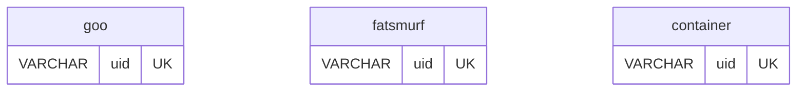

# Perseus PostgreSQL ER Diagram

**Project:** Perseus Database Migration (SQL Server → PostgreSQL 17+)  
**Status:** ✅ Complete  
**Date:** 2026-02-11

## Overview

This directory contains the PostgreSQL-transformed Entity-Relationship diagram for the Perseus database schema. The transformation preserves all 90 tables, 120 relationships, and structural integrity while converting all SQL Server data types to PostgreSQL equivalents.

## Files

| File | Description | Status |
|------|-------------|--------|
| `perseus-ER-diagram-pgsql.mmd` | PostgreSQL ER diagram (Mermaid format) | ✅ Complete |
| `validation-report.md` | Comprehensive validation results | ✅ Complete |
| `TYPE-TRANSFORMATION-REFERENCE.md` | Type mapping reference guide | ✅ Complete |
| `README.md` | This file | ✅ Complete |

## Quick Stats

- **Tables:** 90
- **Relationships:** 120
- **P0 Critical Tables with UID:** 3 (goo, fatsmurf, container)
- **Composite PK Tables:** 6 (m_upstream, m_downstream, material_transition, transition_material, cm_unit_compare, cm_user_group)
- **Zero SQL Server Types Remaining:** ✅

## Key Transformations

### Data Types

| Category | SQL Server → PostgreSQL |
|----------|------------------------|
| **Integers** | `int` → `INTEGER`, `smallint` → `SMALLINT`, `bit` → `INTEGER` |
| **Strings** | `nvarchar`/`varchar` → `VARCHAR`, `char` → `CHAR`, `text` → `TEXT` |
| **Dates** | `datetime`/`datetime2`/`smalldatetime` → `TIMESTAMP` |
| **Decimals** | `float` → `DOUBLE PRECISION`, `real` → `REAL`, `numeric` → `NUMERIC` |
| **Binary** | `image`/`varbinary` → `BYTEA` |
| **Special** | `uniqueidentifier` → `VARCHAR` (for UID columns) |

### P0 Critical Tables

Three tables with UID columns have UK (Unique Key) constraints:



## Usage

### Viewing the Diagram

**Option 1: GitHub (Recommended)**
- Push to GitHub and view in browser (native Mermaid rendering)

**Option 2: Mermaid Live Editor**
```bash
# Copy content and paste into https://mermaid.live
cat perseus-ER-diagram-pgsql.mmd | pbcopy
```

**Option 3: VS Code Extension**
- Install "Markdown Preview Mermaid Support" extension
- Open file and use Markdown preview

### Extracting Table Information

```bash
# List all tables
grep -E "^    [a-z_]* \{$" perseus-ER-diagram-pgsql.mmd

# Find specific table
sed -n '/^    goo {$/,/^    }$/p' perseus-ER-diagram-pgsql.mmd

# List all relationships for a table
grep "goo" perseus-ER-diagram-pgsql.mmd | grep "}o--||"

# Count columns in a table
sed -n '/^    goo {$/,/^    }$/p' perseus-ER-diagram-pgsql.mmd | grep -c "^        "
```

## Validation

All validation checks passed:

```bash
# Zero SQL Server types remaining
grep -E "(nvarchar|datetime|datetime2|smalldatetime|uniqueidentifier)" \
  perseus-ER-diagram-pgsql.mmd | grep -v "bit QC" | wc -l
# Expected: 0 ✅

# Table count matches original
grep -c "^    [a-z_]* {$" perseus-ER-diagram-pgsql.mmd
# Expected: 90 ✅

# Relationship count matches original
grep -c "}o--||" perseus-ER-diagram-pgsql.mmd
# Expected: 120 ✅

# P0 UID columns have UK constraints
grep "VARCHAR uid UK" perseus-ER-diagram-pgsql.mmd | wc -l
# Expected: 3 ✅
```

See `validation-report.md` for detailed validation results.

## Integration with DDL Scripts

This ER diagram serves as the **single source of truth** for table structure validation:

1. **Table DDL Scripts** (`/source/building/pgsql/refactored/14. create-table/`)
   - Must match types in this diagram
   - Add explicit sizes (VARCHAR(50), NUMERIC(18,6), etc.)
   - Add NOT NULL, DEFAULT, and CHECK constraints

2. **Index Scripts** (`/source/building/pgsql/refactored/16. create-index/`)
   - Verify indexed columns exist in this diagram
   - Validate FK relationships

3. **Constraint Scripts** (`/source/building/pgsql/refactored/17-18. constraints/`)
   - All FK relationships shown here must have constraint scripts
   - PK and UK annotations must match actual constraints

## P0 Critical Path Tables

The following tables are on the P0 critical path and require special attention:

| Table | Criticality | Special Requirements |
|-------|-------------|---------------------|
| `goo` | P0 | UID column with UK constraint |
| `fatsmurf` | P0 | UID column with UK constraint |
| `container` | P0 | UID column with UK constraint |
| `material_transition` | P0 | Composite PK (material_id, transition_id) |
| `transition_material` | P0 | Composite PK (transition_id, material_id) |
| `m_upstream` | P0 | Composite PK (end_point, start_point, path) |
| `m_downstream` | P0 | Composite PK (end_point, start_point, path) |

## Next Steps

1. **Cross-Reference with DDL**
   - Compare this diagram with actual CREATE TABLE scripts
   - Verify all type transformations are consistent
   - Ensure sizes (VARCHAR(50), etc.) are appropriate

2. **Validate Relationships**
   - Ensure all 120 FK relationships have corresponding constraint scripts
   - Verify referential integrity rules (CASCADE, RESTRICT, etc.)

3. **Update Documentation**
   - Keep this diagram in sync with any schema changes
   - Update validation report if new tables are added

4. **Integration Testing**
   - Use this diagram to generate test data
   - Validate relationship integrity with actual data

## References

- **Original SQL Server Diagram:** `/Users/pierre.ribeiro/.claude-worktrees/US3-table-structures/docs/db-design/perseus-ER-Diagram.mmd`
- **Project Constitution:** `/docs/POSTGRESQL-PROGRAMMING-CONSTITUTION.md`
- **Type Transformation Guide:** `TYPE-TRANSFORMATION-REFERENCE.md`
- **Validation Report:** `validation-report.md`

## Version History

| Version | Date | Changes |
|---------|------|---------|
| 1.0 | 2026-02-11 | Initial transformation from SQL Server ER diagram |

## Contributing

When making changes to this diagram:

1. Update the ER diagram file
2. Run validation checks (commands above)
3. Update `validation-report.md` with new results
4. Update this README if new patterns are introduced
5. Commit with descriptive message following Conventional Commits

## Contact

**Project Lead:** Pierre Ribeiro (Senior DBA/DBRE)  
**Migration Phase:** User Story 3 - Table Structures  
**Branch:** `us3-table-structures`
