# US7 CITEXT Pipeline — Process Flowcharts

Detailed execution flowcharts for every phase of the CITEXT conversion pipeline.
Render with any Mermaid-compatible viewer.

**Updated:** 2026-03-19 (Debug Round 4 — error log, execute_sql_safe, phantom column validation)

---

## 1. Orchestrator (`run-all.py` / `RunAll.run()`)

```mermaid
flowchart TD
    START([run-all.py]) --> PARSE[Parse CLI args:<br/>--config, --dry-run,<br/>--resume, --manifest,<br/>--log-dir]
    PARSE --> LOAD_CFG[load_config<br/>citext-conversion.yaml]
    LOAD_CFG --> INIT[RunAll.__init__<br/>generate run_id<br/>store config_path]

    INIT --> CHK_RESUME{--resume AND<br/>manifest.json exists?}
    CHK_RESUME -->|Yes| LOAD_MANIFEST[Manifest.load<br/>reuse run_id from prior run]
    CHK_RESUME -->|No| SET_NONE[self.manifest = None<br/>new run_id]
    LOAD_MANIFEST --> RUN
    SET_NONE --> RUN

    RUN[RunAll.run] --> CHK_DRY{--dry-run?}
    CHK_DRY -->|Yes| DRY_RET([Return success=True,<br/>dry_run=True])

    CHK_DRY -->|No| INFRA[ensure_error_log_table<br/>ensure_backup_table<br/>CREATE IF NOT EXISTS]
    INFRA --> INFRA_OK{Infrastructure<br/>tables created?}
    INFRA_OK -->|No| ABORT_INFRA([ABORT:<br/>infrastructure failed])
    INFRA_OK -->|Yes| P0_SKIP

    P0_SKIP{should_skip_phase<br/>'00-preflight'?}
    P0_SKIP -->|Yes<br/>resume: complete| P1_SKIP
    P0_SKIP -->|No| P0[Phase 0:<br/>run_preflight]
    P0 --> P0_ERR{Exception?}
    P0_ERR -->|Yes| P0_LOG_FATAL[log_error FATAL<br/>to error_log table]
    P0_LOG_FATAL --> ABORT_P0([ABORT:<br/>preflight failed])
    P0_ERR -->|No| P0_CONN{preflight.connection<br/>succeeded?}
    P0_CONN -->|No| ABORT_CONN([ABORT:<br/>connection failed])
    P0_CONN -->|Yes| VALIDATE_COLS

    VALIDATE_COLS[validate_columns_exist<br/>batch query<br/>information_schema.columns] --> PHANTOM{Phantom<br/>columns found?}
    PHANTOM -->|No| P1_SKIP
    PHANTOM -->|Yes > 50%| SAFETY([ABORT: Safety valve<br/>likely wrong schema/DB])
    PHANTOM -->|Yes ≤ 50%| PURGE[purge_phantom_columns<br/>backup YAML<br/>remove phantoms<br/>handle FK groups D3]
    PURGE --> RELOAD[self.config =<br/>load_config<br/>RELOADED config]
    RELOAD --> P1_SKIP

    P1_SKIP{should_skip_phase<br/>'01-drop-dependents'?}
    P1_SKIP -->|Yes| P2A_SKIP
    P1_SKIP -->|No| P1_TRY[try: run_drop_dependents<br/>pass run_id]
    P1_TRY --> P1_ERR{Exception?}
    P1_ERR -->|Yes| P1_LOG[log_error FATAL<br/>result.success = False<br/>CONTINUE to next phase]
    P1_ERR -->|No| P2A_SKIP
    P1_LOG --> P2A_SKIP

    P2A_SKIP{should_skip_phase<br/>'02-alter-columns'?}
    P2A_SKIP -->|Yes| P2B_SKIP
    P2A_SKIP -->|No| P2A_TRY[try: run_alter_columns<br/>pass run_id]
    P2A_TRY --> P2A_ERR{Exception?}
    P2A_ERR -->|Yes| P2A_LOG[log_error FATAL<br/>CONTINUE]
    P2A_ERR -->|No| P2B_SKIP
    P2A_LOG --> P2B_SKIP

    P2B_SKIP{should_skip_phase<br/>'02b-alter-cache-tables'<br/>AND module exists?}
    P2B_SKIP -->|Skip| P3_SKIP
    P2B_SKIP -->|Run| P2B_TRY[try: run_alter_cache_tables<br/>pass run_id]
    P2B_TRY --> P2B_ERR{Exception?}
    P2B_ERR -->|Yes| P2B_LOG[log_error FATAL<br/>CONTINUE]
    P2B_ERR -->|No| P3_SKIP
    P2B_LOG --> P3_SKIP

    P3_SKIP{should_skip_phase<br/>'03-recreate-dependents'<br/>AND module exists?}
    P3_SKIP -->|Skip| P4_SKIP
    P3_SKIP -->|Run| P3_TRY[try: run_recreate_dependents<br/>pass run_id]
    P3_TRY --> P3_ERR{Exception?}
    P3_ERR -->|Yes| P3_LOG[log_error FATAL<br/>CONTINUE]
    P3_ERR -->|No| P4_SKIP
    P3_LOG --> P4_SKIP

    P4_SKIP{should_skip_phase<br/>'04-validate-conversion'<br/>AND module exists?}
    P4_SKIP -->|Skip| P5_CHK
    P4_SKIP -->|Run| P4_TRY[try: run_validation<br/>pass run_id]
    P4_TRY --> P4_ERR{Exception?}
    P4_ERR -->|Yes| P4_LOG[log_error FATAL<br/>CONTINUE]
    P4_ERR -->|No| P5_CHK
    P4_LOG --> P5_CHK

    P5_CHK{run_generate_report<br/>module exists?}
    P5_CHK -->|No| SUMMARY
    P5_CHK -->|Yes| P5[Phase 5:<br/>run_generate_report]
    P5 --> SUMMARY

    SUMMARY[get_error_summary<br/>GROUP BY phase, severity] --> DONE([Return result dict<br/>with run_id +<br/>error_summary])

    style ABORT_INFRA fill:#ff6b6b,color:#000
    style ABORT_P0 fill:#ff6b6b,color:#000
    style ABORT_CONN fill:#ff6b6b,color:#000
    style SAFETY fill:#ff6b6b,color:#000
    style DRY_RET fill:#69db7c,color:#000
    style DONE fill:#69db7c,color:#000
    style P0 fill:#74c0fc,color:#000
    style VALIDATE_COLS fill:#74c0fc,color:#000
    style PURGE fill:#ffa94d,color:#000
    style RELOAD fill:#ffa94d,color:#000
    style P1_TRY fill:#ffa94d,color:#000
    style P2A_TRY fill:#b197fc,color:#000
    style P2B_TRY fill:#b197fc,color:#000
    style P3_TRY fill:#63e6be,color:#000
    style P4_TRY fill:#ffd43b,color:#000
    style P1_LOG fill:#ff8787,color:#000
    style P2A_LOG fill:#ff8787,color:#000
    style P2B_LOG fill:#ff8787,color:#000
    style P3_LOG fill:#ff8787,color:#000
    style P4_LOG fill:#ff8787,color:#000
    style INFRA fill:#d0bfff,color:#000
```

---

## 2. Phase 0 — Pre-flight (`preflight_check.py`)

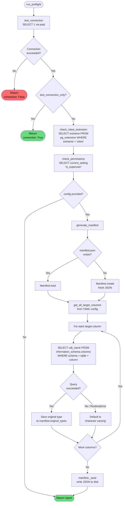

---

## 2a. Column Existence Validation (`validate_columns_exist`)

> Called from `RunAll.run()` AFTER preflight succeeds — NOT inside `run_preflight()`.

```mermaid
flowchart TD
    VAL_START([validate_columns_exist]) --> GET_COLS[get_all_target_columns<br/>from parsed config dict]
    GET_COLS --> EMPTY{Empty list?}
    EMPTY -->|Yes| RET_EMPTY([Return [], []])

    EMPTY -->|No| BATCH[Single batch query:<br/>SELECT table_name, column_name<br/>FROM information_schema.columns<br/>WHERE table_schema = schema<br/>AND table_name, column_name IN ...]

    BATCH --> BUILD_SET[Build existing set<br/>from query results]
    BUILD_SET --> DIFF[Diff expected vs existing<br/>→ valid list + phantom list]

    DIFF --> SAFETY{phantom_count ><br/>50% of total?}
    SAFETY -->|Yes| ABORT([RAISE RuntimeError<br/>SAFETY VALVE:<br/>likely wrong schema/DB<br/>YAML NOT rewritten])
    SAFETY -->|No| RET([Return valid,<br/>phantom lists])

    style VAL_START fill:#74c0fc,color:#000
    style ABORT fill:#ff6b6b,color:#000
    style RET fill:#69db7c,color:#000
    style RET_EMPTY fill:#69db7c,color:#000
```

---

## 2b. Phantom Column Purge (`purge_phantom_columns`)

> Called from `RunAll.run()` when phantoms are found. Rewrites YAML, then config is reloaded.

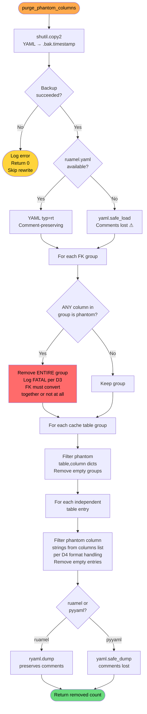

---

## 3. Phase 1 — Drop Dependents (`drop_dependents.py`) — Orchestrator

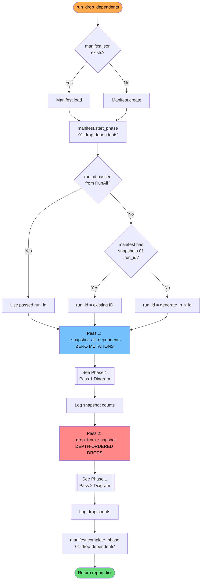

---

## 3a. Phase 1 — Pass 1: Snapshot (Zero Mutations)

```mermaid
flowchart TD
    SNAP_START([_snapshot_all_dependents]) --> ENSURE[ensure_backup_table<br/>CREATE TABLE IF NOT EXISTS<br/>public.citext_migration_backup]

    ENSURE --> HAS_SNAP{has_snapshot<br/>run_id + phase<br/>already in backup?}
    HAS_SNAP -->|Yes| SNAP_SKIP([Return counts=0<br/>Skip Pass 1<br/>RESUME SUPPORT])

    HAS_SNAP -->|No| GET_COLS[get_all_target_columns<br/>from YAML config]
    GET_COLS --> TABLES[Extract unique<br/>target_tables set]

    %% === VIEW DISCOVERY ===
    TABLES --> TBL_LOOP[For each target table<br/>sorted alphabetically]
    TBL_LOOP --> DISCOVER[discover_all_dependent_views<br/>RECURSIVE CTE via<br/>pg_depend + pg_rewrite]
    DISCOVER --> CTE_DETAIL[CTE walks:<br/>depth 0 = direct deps<br/>depth 1+ = transitive deps<br/>Returns name, type, MAX depth]
    CTE_DETAIL --> DEDUP{View already<br/>in seen_views?}
    DEDUP -->|Yes, depth higher| UPDATE_DEPTH[Update to higher depth]
    DEDUP -->|Yes, depth same/lower| SKIP_VIEW[Skip duplicate]
    DEDUP -->|No, new view| ADD_VIEW[Add to seen_views]
    UPDATE_DEPTH --> MORE_TBLS
    SKIP_VIEW --> MORE_TBLS
    ADD_VIEW --> MORE_TBLS
    MORE_TBLS{More tables?}
    MORE_TBLS -->|Yes| TBL_LOOP
    MORE_TBLS -->|No| DDL_LOOP

    %% === DDL CAPTURE ===
    DDL_LOOP[For each discovered view/MV] --> TRY_DDL[Try _get_view_ddl<br/>pg_get_viewdef via regclass]
    TRY_DDL --> DDL_OK{pg_get_viewdef<br/>succeeded?}
    DDL_OK -->|Yes| BUILD_DDL[Build CREATE DDL:<br/>MV → CREATE MATERIALIZED VIEW<br/>View → CREATE OR REPLACE VIEW]

    DDL_OK -->|No / RuntimeError| FALLBACK[get_latest_backup_for_object<br/>Query backup table for<br/>ANY prior run's DDL]
    FALLBACK --> FB_OK{Fallback DDL<br/>found?}
    FB_OK -->|Yes| USE_FB[Use fallback DDL]
    FB_OK -->|No| LOG_ERR[Log ERROR:<br/>No DDL available<br/>Skip this object]
    LOG_ERR --> MORE_VIEWS

    BUILD_DDL --> SNAP_VIEW[snapshot_object → INSERT INTO<br/>backup table ON CONFLICT<br/>DO NOTHING idempotent]
    USE_FB --> SNAP_VIEW
    SNAP_VIEW --> MAN_REC[manifest.record_dropped<br/>secondary backup in JSON]
    MAN_REC --> COUNT_VIEW[Increment views/mvs count]
    COUNT_VIEW --> MORE_VIEWS{More views?}
    MORE_VIEWS -->|Yes| DDL_LOOP
    MORE_VIEWS -->|No| IDX_PHASE

    %% === INDEX DISCOVERY ===
    IDX_PHASE[For each target column] --> DISC_IDX[discover_indexes<br/>pg_index + pg_get_indexdef]
    DISC_IDX --> IDX_DEDUP{Index already<br/>in seen_indexes?}
    IDX_DEDUP -->|Yes| SKIP_IDX[Skip duplicate]
    IDX_DEDUP -->|No| SNAP_IDX[snapshot_object<br/>type=index, depth=0]
    SNAP_IDX --> MAN_IDX[manifest.record_dropped<br/>index DDL]
    MAN_IDX --> MORE_IDX
    SKIP_IDX --> MORE_IDX
    MORE_IDX{More columns?}
    MORE_IDX -->|Yes| IDX_PHASE
    MORE_IDX -->|No| FK_PHASE

    %% === FK CONSTRAINT DISCOVERY ===
    FK_PHASE[For each FK group → column] --> DISC_FK[discover_fk_constraints<br/>REAL names from pg_constraint<br/>NOT guessed fk_table_col]
    DISC_FK --> FK_LOOP[For each discovered FK]
    FK_LOOP --> FK_SEEN{Constraint already<br/>in seen_constraints?}
    FK_SEEN -->|Yes| SKIP_FK[Skip]
    FK_SEEN -->|No| GET_CREATE[try: _get_fk_create_ddl<br/>pg_get_constraintdef → format<br/>ALTER TABLE ADD CONSTRAINT]
    GET_CREATE --> CREATE_OK{CREATE DDL<br/>captured?}
    CREATE_OK -->|No / empty| WARN_FK[Log WARNING + log_error<br/>to error_log table]
    CREATE_OK -->|RuntimeError| ERR_FK[Log WARNING + log_error<br/>FK DDL capture failed]
    CREATE_OK -->|Yes| SNAP_FK[snapshot_object<br/>type=constraint<br/>CREATE DDL stored]
    SNAP_FK --> MAN_FK[manifest.record_dropped<br/>constraint CREATE DDL]
    MAN_FK --> MORE_FK
    WARN_FK --> MORE_FK
    ERR_FK --> MORE_FK
    SKIP_FK --> MORE_FK
    MORE_FK{More FKs?}
    MORE_FK -->|Yes| FK_LOOP
    MORE_FK -->|No| SAVE_RUN

    %% === FINALIZE ===
    SAVE_RUN[Save to manifest:<br/>snapshots.01-drop-dependents.run_id<br/>snapshots.01-drop-dependents.counts]
    SAVE_RUN --> MAN_SAVE[manifest._save<br/>write JSON]
    MAN_SAVE --> SNAP_RET([Return counts dict])

    style SNAP_START fill:#74c0fc,color:#000
    style SNAP_SKIP fill:#ffd43b,color:#000
    style LOG_ERR fill:#ff6b6b,color:#000
    style ERR_FK fill:#ff8787,color:#000
    style SNAP_RET fill:#69db7c,color:#000
    style DISCOVER fill:#d0bfff,color:#000
    style GET_CREATE fill:#d0bfff,color:#000
```

---

## 3b. Phase 1 — Pass 2: Drop from Snapshot

```mermaid
flowchart TD
    DROP_START([_drop_from_snapshot]) --> LOAD_SNAP[get_snapshot<br/>SELECT * FROM backup table<br/>WHERE run_id + phase<br/>ORDER BY depth]

    LOAD_SNAP --> EMPTY{Snapshot<br/>empty?}
    EMPTY -->|Yes| WARN_EMPTY([Log WARNING:<br/>nothing to drop<br/>Return empty report])

    EMPTY -->|No| CLASSIFY[Classify objects:<br/>views_mvs = view + materialized_view<br/>indexes = index<br/>constraints = constraint]
    CLASSIFY --> SORT[Sort views_mvs<br/>by depth DESC<br/>deepest first = leaves]

    %% === DROP VIEWS/MVS ===
    SORT --> VM_LOOP[For each view/MV<br/>depth DESC order]
    VM_LOOP --> VM_STATUS{status ==<br/>'dropped'?}
    VM_STATUS -->|Yes| VM_SKIP[Skip<br/>already dropped]
    VM_STATUS -->|No| VM_TYPE{object_type?}
    VM_TYPE -->|materialized_view| MV_SQL[DROP MATERIALIZED VIEW<br/>IF EXISTS schema.name CASCADE]
    VM_TYPE -->|view| V_SQL[DROP VIEW IF EXISTS<br/>schema.name CASCADE]

    MV_SQL --> EXEC_VM[execute_sql]
    V_SQL --> EXEC_VM
    EXEC_VM --> VM_OK{SQL<br/>succeeded?}
    VM_OK -->|Yes| MARK_VM[mark_dropped<br/>in backup table]
    VM_OK -->|No / RuntimeError| VM_ABSENT[Log WARNING:<br/>already absent]
    VM_ABSENT --> MARK_VM_ABS[mark_dropped<br/>note='already absent']

    MARK_VM --> COUNT_VM[Increment<br/>views_dropped or<br/>mv_dropped]
    MARK_VM_ABS --> MORE_VM
    COUNT_VM --> MORE_VM
    VM_SKIP --> MORE_VM
    MORE_VM{More<br/>views/MVs?}
    MORE_VM -->|Yes| VM_LOOP
    MORE_VM -->|No| IDX_LOOP

    %% === DROP INDEXES ===
    IDX_LOOP[For each index] --> IDX_STATUS{status ==<br/>'dropped'?}
    IDX_STATUS -->|Yes| IDX_SKIP[Skip]
    IDX_STATUS -->|No| IDX_SQL[DROP INDEX IF EXISTS<br/>schema.name]
    IDX_SQL --> EXEC_IDX[execute_sql]
    EXEC_IDX --> IDX_OK{Succeeded?}
    IDX_OK -->|Yes| MARK_IDX[mark_dropped]
    IDX_OK -->|No| IDX_ABS[mark_dropped<br/>note='already absent']
    MARK_IDX --> COUNT_IDX[indexes_dropped++]
    IDX_ABS --> MORE_IDX
    COUNT_IDX --> MORE_IDX
    IDX_SKIP --> MORE_IDX
    MORE_IDX{More<br/>indexes?}
    MORE_IDX -->|Yes| IDX_LOOP
    MORE_IDX -->|No| FK_LOOP

    %% === DROP FK CONSTRAINTS ===
    FK_LOOP[For each constraint] --> FK_STATUS{status ==<br/>'dropped'?}
    FK_STATUS -->|Yes| FK_SKIP[Skip]
    FK_STATUS -->|No| LOOKUP_TBL[SELECT t.relname<br/>FROM pg_constraint<br/>WHERE conname = cname]
    LOOKUP_TBL --> TBL_FOUND{Table name<br/>found?}
    TBL_FOUND -->|Yes| FK_SQL[ALTER TABLE schema.table<br/>DROP CONSTRAINT IF EXISTS<br/>cname]
    TBL_FOUND -->|No| FK_MARK_ONLY[mark_dropped<br/>constraint gone]
    FK_SQL --> EXEC_FK[execute_sql]
    EXEC_FK --> FK_OK{Succeeded?}
    FK_OK -->|Yes| MARK_FK[mark_dropped]
    FK_OK -->|No / RuntimeError| FK_ABS[mark_dropped<br/>note='already absent']
    MARK_FK --> COUNT_FK[constraints_dropped++]
    FK_ABS --> COUNT_FK
    FK_MARK_ONLY --> COUNT_FK
    COUNT_FK --> MORE_FK
    FK_SKIP --> MORE_FK
    MORE_FK{More<br/>constraints?}
    MORE_FK -->|Yes| FK_LOOP
    MORE_FK -->|No| DROP_RET([Return report dict])

    style DROP_START fill:#ff8787,color:#000
    style WARN_EMPTY fill:#ffd43b,color:#000
    style DROP_RET fill:#69db7c,color:#000
    style SORT fill:#d0bfff,color:#000
```

---

## 4. Phase 2a — ALTER Regular Columns (`alter_columns.py`)

```mermaid
flowchart TD
    P2A_START([run_alter_columns]) --> MAN{manifest.json<br/>exists?}
    MAN -->|Yes| LOAD[Manifest.load]
    MAN -->|No| CREATE[Manifest.create]
    LOAD --> START
    CREATE --> START

    START[manifest.start_phase<br/>'02-alter-columns'] --> CACHE_SET[cache_tables = set of<br/>cache table names<br/>to EXCLUDE]
    CACHE_SET --> REG_COLS[get_regular_columns<br/>independent_columns<br/>from YAML]
    REG_COLS --> GROUP[Group columns by table<br/>excluding cache tables]

    %% === REGULAR COLUMNS ===
    GROUP --> TBL_LOOP[For each table<br/>sorted alphabetically]
    TBL_LOOP --> EMPTY_COLS{Columns list<br/>empty?}
    EMPTY_COLS -->|Yes| NEXT_TBL
    EMPTY_COLS -->|No| COL_LOOP[alter_table_columns_with_resume]

    COL_LOOP --> CHK_MAN{manifest.is_column_converted<br/>table.column?}
    CHK_MAN -->|Yes| SKIP_MAN[Skip — manifest<br/>says converted]
    CHK_MAN -->|No| CHK_DB{verify_column_type<br/>try/except wrapped<br/>returns False on error}
    CHK_DB -->|Yes / already CITEXT| WARN_SKIP[Log WARNING:<br/>already CITEXT — skipping<br/>manifest.record as 'citext']
    CHK_DB -->|No / needs ALTER| DO_ALTER[execute_sql_safe<br/>ALTER TABLE schema.table<br/>ALTER COLUMN col TYPE citext]
    DO_ALTER --> ALTER_OK{Success?}
    ALTER_OK -->|Yes| REC_ALT[manifest.record_column_converted<br/>original='character varying']
    ALTER_OK -->|No| LOG_ALT[Log error + continue<br/>Error auto-logged<br/>to error_log table]
    REC_ALT --> MORE_COLS
    LOG_ALT --> MORE_COLS

    SKIP_MAN --> MORE_COLS
    WARN_SKIP --> MORE_COLS
    MORE_COLS{More columns<br/>in table?}
    MORE_COLS -->|Yes| CHK_MAN
    MORE_COLS -->|No| COUNT_TBL[columns_converted +=<br/>errors_count +=]
    COUNT_TBL --> NEXT_TBL{More tables?}
    NEXT_TBL -->|Yes| TBL_LOOP
    NEXT_TBL -->|No| FK_GROUPS

    %% === FK GROUPS ===
    FK_GROUPS[For each FK group<br/>from config.fk_groups] --> FK_COL_LOOP[For each column in group]
    FK_COL_LOOP --> FK_CHK{verify_column_type<br/>already CITEXT?}
    FK_CHK -->|Yes| FK_WARN[Log WARNING:<br/>FK column already CITEXT<br/>manifest.record as 'citext']
    FK_CHK -->|No| FK_ADD[Add to<br/>columns_to_alter list]
    FK_WARN --> MORE_FK_COLS
    FK_ADD --> MORE_FK_COLS
    MORE_FK_COLS{More columns<br/>in group?}
    MORE_FK_COLS -->|Yes| FK_COL_LOOP
    MORE_FK_COLS -->|No| FK_EMPTY{columns_to_alter<br/>empty?}

    FK_EMPTY -->|Yes| NEXT_GRP[Skip group<br/>nothing to ALTER]
    FK_EMPTY -->|No| FK_TXN[alter_fk_group<br/>execute_sql_safe<br/>BEGIN;<br/>  ALTER ... TYPE citext;<br/>COMMIT;]
    FK_TXN --> FK_OK{Success?}
    FK_OK -->|Yes| REC_FK[For each altered:<br/>manifest.record_column_converted]
    FK_OK -->|No| FK_ERR[Log error for each<br/>column in group<br/>errors_count +=<br/>CONTINUE to next group]
    REC_FK --> NEXT_GRP
    FK_ERR --> NEXT_GRP
    NEXT_GRP{More FK<br/>groups?}
    NEXT_GRP -->|Yes| FK_GROUPS
    NEXT_GRP -->|No| COMPLETE

    COMPLETE[manifest.complete_phase] --> P2A_RET([Return<br/>columns_converted,<br/>tables_processed,<br/>errors_count])

    style P2A_START fill:#b197fc,color:#000
    style P2A_RET fill:#69db7c,color:#000
    style FK_TXN fill:#ffa94d,color:#000
    style DO_ALTER fill:#ffa94d,color:#000
    style WARN_SKIP fill:#ffd43b,color:#000
    style FK_WARN fill:#ffd43b,color:#000
    style LOG_ALT fill:#ff8787,color:#000
    style FK_ERR fill:#ff8787,color:#000
```

---

## 5. Phase 2b — ALTER Cache Tables (`alter_cache_tables.py`)

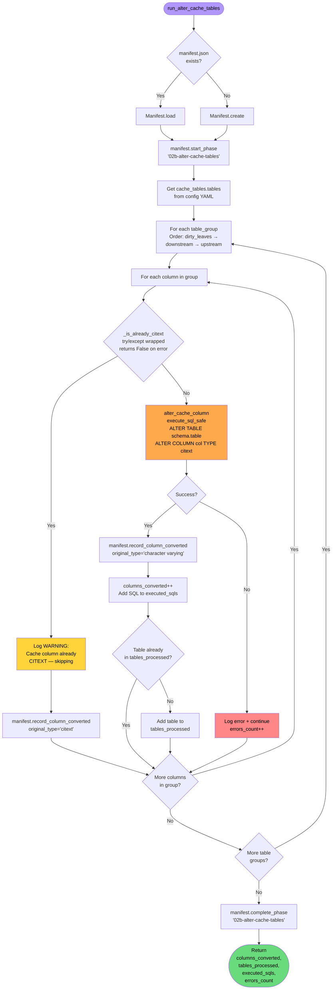

---

## 6. Phase 3 — Recreate Dependents (`recreate_dependents.py`)

```mermaid
flowchart TD
    P3_START([run_recreate_dependents]) --> MAN{manifest.json<br/>exists?}
    MAN -->|Yes| LOAD[Manifest.load]
    MAN -->|No| CREATE[Manifest.create]
    LOAD --> START
    CREATE --> START

    START[manifest.start_phase<br/>'03-recreate-dependents'] --> RUN_ID{run_id passed<br/>from RunAll OR<br/>in manifest?}

    RUN_ID -->|No| FALLBACK_PATH[dependents = None]
    RUN_ID -->|Yes| TRY_BACKUP[Try _load_dependents_from_backup<br/>get_snapshot from<br/>citext_migration_backup table]

    TRY_BACKUP --> BACKUP_OK{Backup query<br/>succeeded AND<br/>has objects?}
    BACKUP_OK -->|Yes| USE_BACKUP[Use backup table data<br/>organized by type + depth]
    BACKUP_OK -->|No / RuntimeError| FALLBACK_PATH

    FALLBACK_PATH --> USE_MANIFEST[_load_dependents_from_manifest<br/>Read dropped list from<br/>phases.01-drop-dependents.dropped]
    USE_MANIFEST --> RECREATE
    USE_BACKUP --> RECREATE

    %% === RECREATE INDEXES ===
    RECREATE[Begin recreation sequence] --> IDX_CHK{indexes list<br/>not empty?}
    IDX_CHK -->|No| FK_CHK
    IDX_CHK -->|Yes| IDX_LOOP[For each index]
    IDX_LOOP --> IDX_IDEMP[_make_idempotent_index<br/>Inject IF NOT EXISTS]
    IDX_IDEMP --> IDX_EXEC[execute_sql_safe<br/>log + continue on error]
    IDX_EXEC --> IDX_OK{Success?}
    IDX_OK -->|Yes| IDX_MARK[mark_recreated +<br/>add to sqls]
    IDX_OK -->|No| IDX_ERR[Log error<br/>errors_count++]
    IDX_MARK --> MORE_IDX{More?}
    IDX_ERR --> MORE_IDX
    MORE_IDX -->|Yes| IDX_LOOP
    MORE_IDX -->|No| FK_CHK

    %% === RECREATE FK CONSTRAINTS ===
    FK_CHK{constraints list<br/>not empty?}
    FK_CHK -->|No| MV_CHK
    FK_CHK -->|Yes| FK_LOOP[For each constraint]
    FK_LOOP --> FK_EXEC[Execute CREATE DDL<br/>ALTER TABLE ADD CONSTRAINT]
    FK_EXEC --> FK_OK{Succeeded?}
    FK_OK -->|Yes| FK_MARK[mark_recreated]
    FK_OK -->|No / RuntimeError| FK_EXISTS{'already exists'<br/>in error msg?}
    FK_EXISTS -->|Yes| FK_WARN[Log WARNING:<br/>already exists — skip]
    FK_EXISTS -->|No| FK_LOG[Log ERROR + log_error<br/>to error_log table]
    FK_MARK --> MORE_FK
    FK_WARN --> MORE_FK
    FK_LOG --> MORE_FK
    MORE_FK{More?}
    MORE_FK -->|Yes| FK_LOOP
    MORE_FK -->|No| MV_CHK

    %% === RECREATE MVS ===
    MV_CHK{materialized_views<br/>list not empty?}
    MV_CHK -->|No| VIEW_CHK
    MV_CHK -->|Yes| MV_LOOP[For each MV]
    MV_LOOP --> MV_EXEC[execute_sql_safe<br/>CREATE MATERIALIZED VIEW]
    MV_EXEC --> MV_OK{Success?}
    MV_OK -->|Yes| MV_MARK[mark_recreated]
    MV_OK -->|No| MV_ERR[Log error<br/>errors_count++]
    MV_MARK --> MORE_MV{More?}
    MV_ERR --> MORE_MV
    MORE_MV -->|Yes| MV_LOOP
    MORE_MV -->|No| VIEW_CHK

    %% === RECREATE VIEWS ===
    VIEW_CHK{views dict<br/>not empty?}
    VIEW_CHK -->|No| COMPLETE
    VIEW_CHK -->|Yes| DEPTH_LOOP[For each depth level<br/>sorted ASC<br/>depth 0 first = root views]
    DEPTH_LOOP --> VIEW_LOOP[For each view at this depth]
    VIEW_LOOP --> VIEW_IDEMP[_make_idempotent_view<br/>Inject OR REPLACE]
    VIEW_IDEMP --> VIEW_EXEC[execute_sql_safe<br/>log + continue on error]
    VIEW_EXEC --> VIEW_OK{Success?}
    VIEW_OK -->|Yes| VIEW_MARK[mark_recreated]
    VIEW_OK -->|No| VIEW_ERR[Log error<br/>errors_count++]
    VIEW_MARK --> MORE_VIEW{More views?}
    VIEW_ERR --> MORE_VIEW
    MORE_VIEW -->|Yes| VIEW_LOOP
    MORE_VIEW -->|No| MORE_DEPTH{More depths?}
    MORE_DEPTH -->|Yes| DEPTH_LOOP
    MORE_DEPTH -->|No| COMPLETE

    COMPLETE[manifest.complete_phase] --> P3_RET([Return report:<br/>indexes_created,<br/>constraints_created,<br/>mv_created,<br/>views_created,<br/>errors_count])

    style P3_START fill:#63e6be,color:#000
    style P3_RET fill:#69db7c,color:#000
    style FK_LOG fill:#ff8787,color:#000
    style IDX_ERR fill:#ff8787,color:#000
    style MV_ERR fill:#ff8787,color:#000
    style VIEW_ERR fill:#ff8787,color:#000
    style FK_WARN fill:#ffd43b,color:#000
    style USE_BACKUP fill:#74c0fc,color:#000
    style USE_MANIFEST fill:#ffa94d,color:#000
```

---

## 7. Phase 4 — Validate (`validate_conversion.py`)

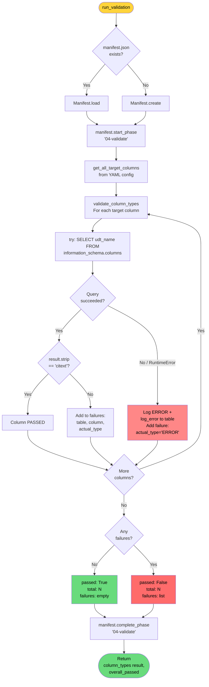

---

## 8. Error Logging Architecture

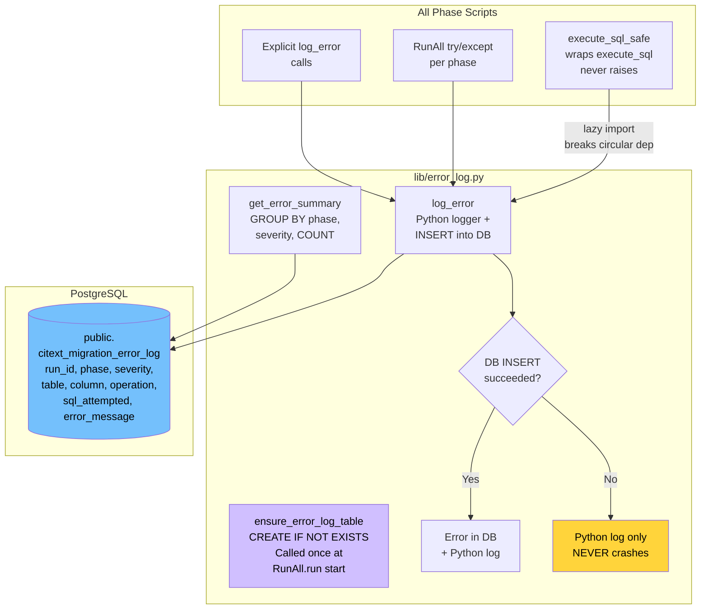

---

## 9. Data Flow — Backup Table, Error Log & Manifest Lifecycle

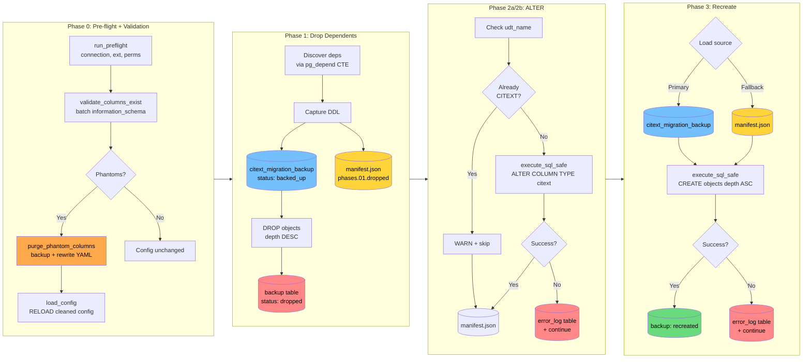

---

## 10. Crash Recovery — Resume Paths

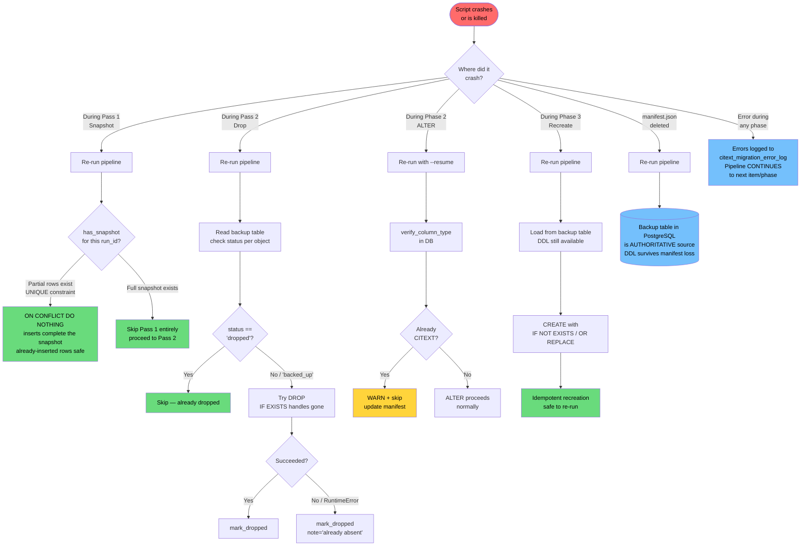

---

## Legend

| Color | Meaning |
|-------|---------|
| Blue | Read-only / data source / infrastructure |
| Orange | Mutation / write operation |
| Purple | Decision with branching / infrastructure setup |
| Green | Success / completed |
| Red | Error / abort / FATAL |
| Light Red | Non-fatal error (logged, continues) |
| Yellow | Warning / skip |
