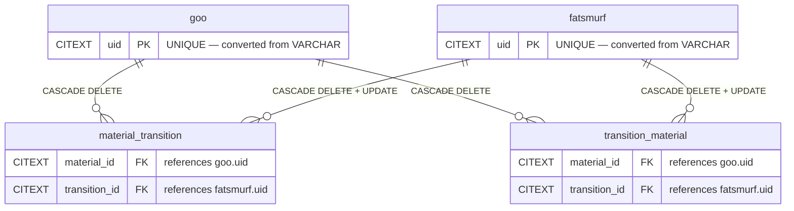
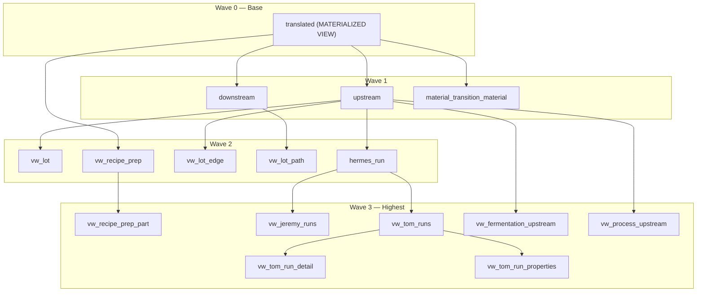
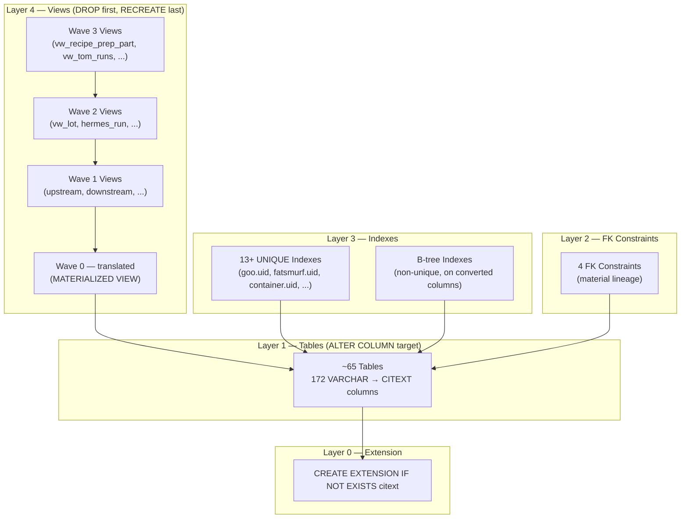

# CITEXT Column Conversion — Dependency Analysis (US7)

## Overview

This document analyzes the full dependency chain for converting **172 VARCHAR columns to CITEXT** across approximately **65 tables** in the Perseus database. The conversion eliminates case-sensitivity bugs in lookups, JOINs, and WHERE clauses without requiring application-level `LOWER()`/`UPPER()` calls.

**Scope:** All objects that must be dropped, altered, or recreated to safely execute the column type changes.

**Risk Level:** P0 CRITICAL — the FK dependency group involves the material lineage tables (`goo`, `fatsmurf`, `material_transition`, `transition_material`) which are on the project's critical path.

---

## 1. FK Dependencies (Material Lineage — P0 CRITICAL)

Four foreign key constraints link columns that are candidates for CITEXT conversion. Because PostgreSQL requires exact type matching between FK parent and child columns, **all 6 columns across 4 tables MUST be converted in the same transaction**.

### 1.1 Constraints

| Constraint | Parent Table.Column | Child Table.Column | ON DELETE | ON UPDATE |
|---|---|---|---|---|
| `fk_material_transition_material_id` | `goo.uid` | `material_transition.material_id` | CASCADE | NO ACTION |
| `fk_material_transition_transition_id` | `fatsmurf.uid` | `material_transition.transition_id` | CASCADE | CASCADE |
| `fk_transition_material_material_id` | `goo.uid` | `transition_material.material_id` | CASCADE | NO ACTION |
| `fk_transition_material_transition_id` | `fatsmurf.uid` | `transition_material.transition_id` | CASCADE | CASCADE |

### 1.2 Required Execution Order

1. **DROP** all 4 FK constraints
2. **ALTER COLUMN** on all 6 columns (`goo.uid`, `fatsmurf.uid`, `material_transition.material_id`, `material_transition.transition_id`, `transition_material.material_id`, `transition_material.transition_id`) to `CITEXT`
3. **RECREATE** all 4 FK constraints with identical ON DELETE / ON UPDATE rules

All three steps must execute inside a single `BEGIN` / `COMMIT` block.

### 1.3 FK Dependency ER Diagram



---

## 2. View Dependencies (22 Views)

All 22 views that reference converted columns must be **dropped before** the ALTER and **recreated after**. Views are organized into waves by dependency depth.

### 2.1 Wave Assignment

| Wave | Views | Notes |
|---|---|---|
| **Wave 0** (base) | `translated` | MATERIALIZED VIEW. Has `::VARCHAR(50)` casts on lines 100-102 that must change to `::CITEXT`. |
| **Wave 1** | `upstream`, `downstream`, `material_transition_material` | Depend directly on Wave 0 or on base tables. |
| **Wave 2** | `vw_lot`, `hermes_run`, `vw_lot_edge`, `vw_lot_path`, `vw_recipe_prep` | Depend on Wave 0-1 views. |
| **Wave 3** (highest) | `vw_recipe_prep_part`, `vw_jeremy_runs`, `vw_tom_runs`, `vw_tom_run_detail`, `vw_tom_run_properties`, `vw_fermentation_upstream`, `vw_process_upstream`, and remaining views | Depend on Wave 0-2 views. |

### 2.2 Execution Order

- **DROP order (top-down):** Wave 3 first, then Wave 2, Wave 1, Wave 0 last.
- **RECREATE order (bottom-up):** Wave 0 first, then Wave 1, Wave 2, Wave 3 last.

### 2.3 View Dependency DAG



### 2.4 Materialized View: `translated`

The `translated` materialized view requires special attention:

- Lines 100-102 contain explicit `::VARCHAR(50)` casts that **must be changed to `::CITEXT`** in the recreated definition.
- After recreation, run `REFRESH MATERIALIZED VIEW CONCURRENTLY translated;` to repopulate.
- The pg_cron refresh schedule (every 10 min) will continue operating after recreation.

---

## 3. Index Dependencies

13+ UNIQUE indexes exist on target columns and must be **dropped before** the ALTER and **recreated after**. PostgreSQL can sometimes handle `ALTER COLUMN TYPE` with indexes in place, but UNIQUE indexes on VARCHAR columns being converted to CITEXT should be dropped and recreated to ensure the index uses the correct CITEXT operator class.

### 3.1 Key UNIQUE Indexes

| Table | Column(s) | Index Type | Notes |
|---|---|---|---|
| `goo` | `uid` | UNIQUE | P0 — FK parent for material lineage |
| `fatsmurf` | `uid` | UNIQUE | P0 — FK parent for material lineage |
| `container` | `uid` | UNIQUE | High-traffic lookup column |
| Various tables | `name` columns | UNIQUE | Multiple tables have unique name constraints |

### 3.2 Non-UNIQUE Indexes

Additional B-tree indexes on converted columns will also need to be dropped and recreated. The full list should be extracted from the deployed schema using:

```sql
SELECT schemaname, tablename, indexname, indexdef
FROM pg_indexes
WHERE indexdef ILIKE '%varchar%'
  AND tablename IN (/* target table list */);
```

---

## 4. Constraint Dependencies (CHECK, DEFAULT)

### 4.1 CHECK Constraints

Three CHECK constraints exist on `submission_entry` that reference columns being converted:

| Table | Constraint | Status |
|---|---|---|
| `submission_entry` | CHECK constraint 1 | Compatible with CITEXT — no changes needed |
| `submission_entry` | CHECK constraint 2 | Compatible with CITEXT — no changes needed |
| `submission_entry` | CHECK constraint 3 | Compatible with CITEXT — no changes needed |

CHECK constraints that perform string comparisons will benefit from CITEXT's case-insensitive behavior. No manual intervention required.

### 4.2 DEFAULT Values

| Table | Column | DEFAULT Expression | Status |
|---|---|---|---|
| `container` | `scope_id` | `gen_random_uuid()` | Compatible — `gen_random_uuid()` returns `TEXT`, which casts implicitly to `CITEXT` |

No DEFAULT expressions require modification.

---

## 5. Overall Dependency Graph



### Execution Sequence

| Step | Action | Layer |
|---|---|---|
| 1 | Ensure `citext` extension is enabled | Layer 0 |
| 2 | DROP Wave 3 views | Layer 4 |
| 3 | DROP Wave 2 views | Layer 4 |
| 4 | DROP Wave 1 views | Layer 4 |
| 5 | DROP Wave 0 (`translated` materialized view) | Layer 4 |
| 6 | DROP 13+ UNIQUE and B-tree indexes | Layer 3 |
| 7 | DROP 4 FK constraints (material lineage) | Layer 2 |
| 8 | **ALTER COLUMN ... TYPE CITEXT** on all 172 columns (~65 tables) | Layer 1 |
| 9 | RECREATE 4 FK constraints | Layer 2 |
| 10 | RECREATE UNIQUE and B-tree indexes | Layer 3 |
| 11 | RECREATE Wave 0 (`translated` — with `::CITEXT` casts) | Layer 4 |
| 12 | `REFRESH MATERIALIZED VIEW translated` | Layer 4 |
| 13 | RECREATE Wave 1 views | Layer 4 |
| 14 | RECREATE Wave 2 views | Layer 4 |
| 15 | RECREATE Wave 3 views | Layer 4 |

---

## 6. Impact Summary

| Dependency Type | Count | Action Required | Risk |
|---|---|---|---|
| **FK Constraints** | 4 | DROP + ALTER 6 cols in same txn + RECREATE | P0 CRITICAL |
| **Views (standard)** | 21 | DROP (top-down) + RECREATE (bottom-up) | P1 HIGH |
| **Materialized View** | 1 (`translated`) | DROP + RECREATE with cast fix + REFRESH | P0 CRITICAL |
| **UNIQUE Indexes** | 13+ | DROP + RECREATE | P1 HIGH |
| **B-tree Indexes** | TBD | DROP + RECREATE | P2 MEDIUM |
| **CHECK Constraints** | 3 | No action — compatible | P3 NONE |
| **DEFAULT Values** | 1 | No action — compatible | P3 NONE |
| **Tables (ALTER)** | ~65 | ALTER COLUMN TYPE CITEXT (172 columns) | P1 HIGH |
| **Procedures/Functions** | ~40 | **DEFERRED** — see section 7 | P2 MEDIUM |

**Total objects affected:** ~105+ (excluding deferred procedures/functions)

---

## 7. Procedures and Functions (DEFERRED)

15 stored procedures and approximately 25 functions reference columns being converted to CITEXT. These objects are **not modified in US7** — updates are deferred to a future worktree.

### 7.1 Rationale for Deferral

- CITEXT is assignment-compatible with VARCHAR/TEXT — existing procedure parameters accepting `VARCHAR` will implicitly accept `CITEXT` values.
- Explicit `::VARCHAR` casts inside procedures may mask CITEXT benefits (case-insensitive comparison) but will not cause runtime errors.
- A dedicated worktree allows focused testing of each procedure against CITEXT columns without blocking the column conversion.

### 7.2 Known References (Documentation Only)

| Object Type | Approximate Count | Example Objects |
|---|---|---|
| Stored Procedures | 15 | `get_material_by_run_properties`, `reconcile_mupstream`, `move_node` |
| Table-Valued Functions | ~15 | `mcgetupstream`, `mcgetdownstream`, `mcgetupstreambylist`, `mcgetdownstreambylist` |
| Scalar Functions | ~10 | Various lookup/helper functions |

### 7.3 Future Work Items

- Audit all `::VARCHAR` and `::TEXT` casts in procedures/functions for unnecessary cast-downs from CITEXT.
- Update parameter types from `VARCHAR(n)` to `CITEXT` where appropriate.
- Re-run unit tests (`tests/unit/test_*.sql`) against CITEXT schema to validate compatibility.

---

## References

- `specs/001-tsql-to-pgsql/tasks.md` — US7 task definitions
- `docs/POSTGRESQL-PROGRAMMING-CONSTITUTION.md` — Article II (Strict Typing)
- `docs/db-design/pgsql/TYPE-TRANSFORMATION-REFERENCE.md` — Type mapping reference
- `docs/code-analysis/dependency/dependency-analysis-consolidated.md` — Full 769-object dependency map
- `prompts/columns_citext_candidates.txt` — Column candidate list for CITEXT conversion

---

**Author:** Claude Code (US7 worktree) | **Date:** 2026-03-17 | **Status:** Analysis Complete
