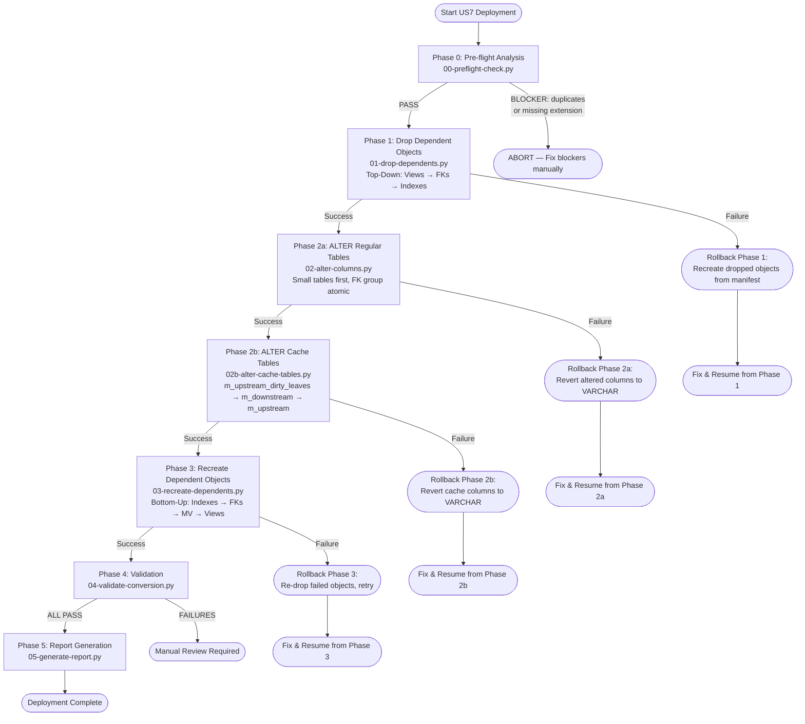
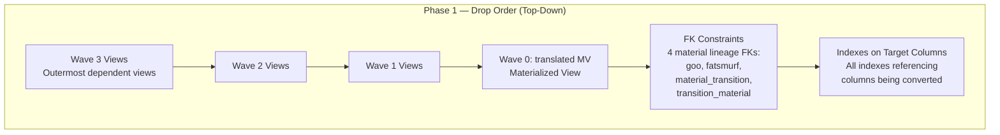
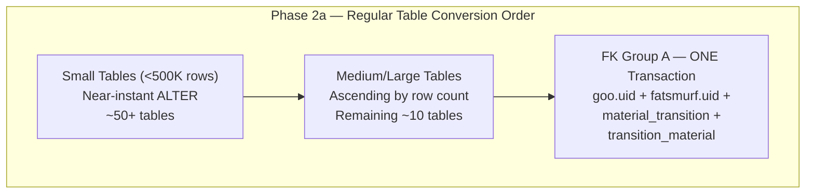
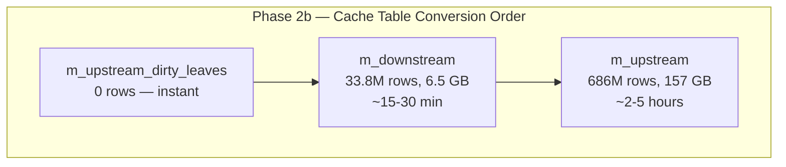
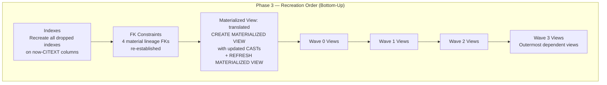
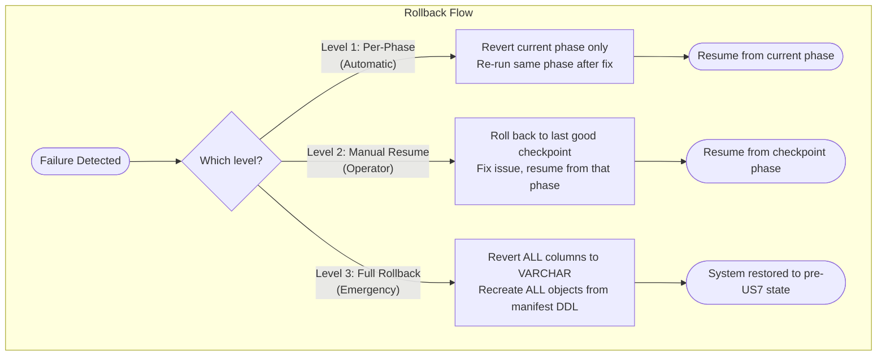

# US7: CITEXT Deployment Workflow

> **Scope:** Convert 172 VARCHAR columns to CITEXT across ~65 PostgreSQL tables
> **Database:** perseus_dev / perseus_staging / perseus_prod
> **Estimated Total Duration:** 4-8 hours (dominated by Phase 2b cache tables)
> **Last Updated:** 2026-03-17

---

## Table of Contents

1. [Overview](#overview)
2. [Main Phase Flowchart](#main-phase-flowchart)
3. [Phase 0: Pre-flight Analysis](#phase-0-pre-flight-analysis)
4. [Phase 1: Drop Dependent Objects](#phase-1-drop-dependent-objects)
5. [Phase 2a: ALTER Regular Tables](#phase-2a-alter-regular-tables)
6. [Phase 2b: ALTER Cache Tables](#phase-2b-alter-cache-tables)
7. [Phase 3: Recreate Dependent Objects](#phase-3-recreate-dependent-objects)
8. [Phase 4: Validation](#phase-4-validation)
9. [Phase 5: Report Generation](#phase-5-report-generation)
10. [Resume/Checkpoint Mechanism](#resumecheckpoint-mechanism)
11. [Rollback Strategy](#rollback-strategy)
12. [Estimated Timings](#estimated-timings)
13. [Pre-Execution Checklist](#pre-execution-checklist)
14. [Post-Execution Checklist](#post-execution-checklist)

---

## Overview

The CITEXT conversion enables case-insensitive text comparison at the column type level, eliminating scattered `LOWER()` and `ILIKE` workarounds throughout queries, views, and stored procedures. All 172 target columns are converted via `ALTER COLUMN ... TYPE CITEXT USING column_name::CITEXT`, which rewrites the column in-place without data loss.

The workflow is implemented as six Python scripts executed sequentially, with a shared `manifest.json` providing state continuity and checkpoint/resume capability across phases.

---

## Main Phase Flowchart



---

## Phase 0: Pre-flight Analysis

**Script:** `00-preflight-check.py`
**Duration:** < 1 minute
**Destructive:** No

### What It Does

1. **Verify citext extension** — Confirms `CREATE EXTENSION IF NOT EXISTS citext` has been applied; aborts if the extension cannot be loaded.
2. **Connectivity and permissions** — Tests the database connection and confirms the executing role has `ALTER TABLE` and `CREATE/DROP` privileges on all target schemas.
3. **Dynamic dependency discovery** — Queries `pg_catalog` (`pg_depend`, `pg_class`, `pg_attribute`, `pg_constraint`, `pg_index`) to build the full dependency graph: which views, FK constraints, and indexes reference each target column.
4. **Case-variant duplicate check** — For every target column, runs:
   ```sql
   SELECT column_name, LOWER(column_name::TEXT) AS lc, COUNT(*)
   FROM schema.table
   GROUP BY lc
   HAVING COUNT(*) > 1;
   ```
   Any result is a **BLOCKER** — CITEXT would merge previously distinct rows, causing unique constraint violations or silent data corruption.
5. **Disk space check** — Estimates 1.5x the size of each table (via `pg_total_relation_size`) as headroom for the `ALTER COLUMN` rewrite. Warns if available disk is below the threshold.
6. **Generate manifest.json** — Writes the complete operation plan: every column to alter, every object to drop/recreate, dependency ordering, and estimated sizes. All subsequent phases consume this manifest.

### Decision Gate

| Result | Action |
|--------|--------|
| All checks PASS | Proceed to Phase 1 |
| Case-variant duplicates found | **ABORT** — Resolve duplicates manually before retrying |
| Missing extension / permissions | **ABORT** — Fix infrastructure, re-run Phase 0 |
| Disk space warning | Operator decision: proceed with caution or free space |

---

## Phase 1: Drop Dependent Objects

**Script:** `01-drop-dependents.py`
**Duration:** < 5 minutes
**Destructive:** Yes (objects dropped, DDL saved to manifest for rollback)

### Drop Order (Top-Down)

Objects are dropped from the outermost dependents inward to avoid cascading errors.



### Details

- **Views (Wave 3 -> Wave 0):** Each view's `CREATE OR REPLACE VIEW` DDL is captured to `manifest.json` before dropping. The `translated` materialized view (Wave 0) is dropped last among views because lower-wave views may depend on it.
- **FK Constraints (4 material lineage FKs):** The four FK constraints linking `goo.uid`, `fatsmurf.uid`, `material_transition`, and `transition_material` are dropped. Their full `ALTER TABLE ... ADD CONSTRAINT` DDL is saved.
- **Indexes:** All indexes that include at least one target column are dropped. `CREATE INDEX` DDL is saved.

All DDL is persisted in `manifest.json` under each object entry so Phase 3 can recreate them and rollback can restore them.

---

## Phase 2a: ALTER Regular Tables

**Script:** `02-alter-columns.py`
**Duration:** 5-30 minutes (depends on table sizes)
**Destructive:** Yes (column types changed in-place)

### Conversion Order



### Strategy

1. **Small tables (< 500K rows):** These complete in under a second each. Processed first to build momentum and catch any unexpected issues early.
2. **Large tables:** Processed in ascending size order so that if a failure occurs, maximum progress has been made on smaller tables.
3. **FK Group A** — The four tables linked by material lineage foreign keys (`goo.uid`, `fatsmurf.uid`, `material_transition`, `transition_material`) are altered inside a **single transaction**. This ensures referential integrity is never broken: either all four convert or none do.

### Per-Column Operation

```sql
ALTER TABLE schema.table_name
  ALTER COLUMN column_name TYPE CITEXT USING column_name::CITEXT;
```

### Post-ALTER Verification

After each column conversion, the script verifies:

- `information_schema.columns` shows `data_type = 'USER-DEFINED'` and `udt_name = 'citext'`
- A sample `SELECT` confirms the column is readable
- Checkpoint is written to `manifest.json` (column marked `completed`)

---

## Phase 2b: ALTER Cache Tables

**Script:** `02b-alter-cache-tables.py`
**Duration:** 2-6 hours (dominated by m_upstream)
**Destructive:** Yes

Cache tables are converted **last** because they are the largest and most time-consuming. Separating them into their own phase allows regular tables and their dependents to be validated independently.

### Conversion Order



### Strategy: Direct ALTER (No TRUNCATE)

All three cache tables use the **Direct ALTER** strategy:

```sql
ALTER TABLE perseus.m_upstream
  ALTER COLUMN column_name TYPE CITEXT USING column_name::CITEXT;
```

This approach is preferred over TRUNCATE+rebuild because:

- **Data preservation:** No risk of data loss; the table remains populated throughout.
- **Atomicity:** PostgreSQL rewrites the table in a single operation; on failure, the original data is intact.
- **Simplicity:** No need to coordinate cache rebuild jobs after conversion.

**Trade-off:** The `ALTER` on `m_upstream` (686M rows, 157 GB) will hold an `ACCESS EXCLUSIVE` lock for the duration of the rewrite. Schedule this during a maintenance window.

### Monitoring

During the long-running `m_upstream` ALTER, monitor with:

```sql
SELECT pid, state, wait_event_type, wait_event, query
FROM pg_stat_activity
WHERE query LIKE '%m_upstream%';
```

---

## Phase 3: Recreate Dependent Objects

**Script:** `03-recreate-dependents.py`
**Duration:** 5-30 minutes
**Destructive:** No (additive — creates objects)

### Recreation Order (Bottom-Up)

Objects are recreated from the innermost dependencies outward, the reverse of Phase 1.



### Details

- **Indexes:** Recreated using saved DDL from manifest. CITEXT columns use the same index type (btree/gin) — no operator class changes needed since CITEXT provides its own comparison operators.
- **FK Constraints:** The 4 material lineage FKs are re-added. Since both sides of the FK are now CITEXT, the constraint is compatible.
- **Materialized View (`translated`):** Recreated with updated `CAST` expressions (removing any `LOWER()` wrappers or `::VARCHAR` casts that are now unnecessary). Followed by `REFRESH MATERIALIZED VIEW CONCURRENTLY` if applicable.
- **Views (Wave 0 through Wave 3):** Recreated in ascending wave order. Any `LOWER()` or `UPPER()` calls that were only present for case-insensitive comparison can be removed, but this is an optional optimization — the views will function correctly either way.

---

## Phase 4: Validation

**Script:** `04-validate-conversion.py`
**Duration:** 5-10 minutes
**Destructive:** No

### Validation Checks

| Check | Method | Pass Criteria |
|-------|--------|---------------|
| Column types | `information_schema.columns` | All 172 columns show `udt_name = 'citext'` |
| FK constraints | `pg_constraint` | All 4 material lineage FKs exist and are valid |
| Indexes | `pg_index` + `pg_class` | All previously dropped indexes exist |
| Views queryable | `SELECT 1 FROM view LIMIT 1` | No errors on any recreated view |
| MV populated | `SELECT COUNT(*) FROM translated` | Row count > 0 |
| Case-insensitive behavior | Test query per table | `WHERE col = 'ABC'` matches row inserted as `'abc'` |

### Failure Handling

- Validation failures do NOT trigger automatic rollback
- Failures are logged to `manifest.json` and printed to stdout
- Operator reviews failures and decides: fix forward or rollback

---

## Phase 5: Report Generation

**Script:** `05-generate-report.py`
**Duration:** < 1 minute
**Destructive:** No

Generates a summary markdown report containing:

- **Execution summary:** Total duration, phases completed, success/failure counts
- **Before/after comparison:** Column type snapshots (VARCHAR vs CITEXT) for all 172 columns
- **Table size comparison:** `pg_total_relation_size` before and after for each altered table
- **Dependency recreation status:** Each view, index, and constraint with pass/fail
- **Warnings:** Any non-blocking issues encountered during execution
- **Manifest reference:** Path to the full `manifest.json` for audit

---

## Resume/Checkpoint Mechanism

Every phase writes checkpoints to `manifest.json` as it progresses. The manifest tracks:

```json
{
  "phase": "2a",
  "status": "in_progress",
  "columns": [
    {
      "schema": "perseus",
      "table": "goo",
      "column": "uid",
      "original_type": "character varying(50)",
      "target_type": "citext",
      "status": "completed",
      "completed_at": "2026-03-17T14:32:00Z"
    },
    {
      "schema": "perseus",
      "table": "run_property",
      "column": "name",
      "original_type": "character varying(255)",
      "target_type": "citext",
      "status": "pending"
    }
  ],
  "dropped_objects": [
    {
      "type": "view",
      "name": "perseus.v_material_summary",
      "ddl": "CREATE OR REPLACE VIEW ...",
      "status": "dropped"
    }
  ]
}
```

### How Resume Works

1. Each script reads `manifest.json` on startup.
2. Objects/columns marked `completed` are **skipped**.
3. Objects marked `pending` or `failed` are **retried**.
4. If a script is re-run after a partial failure, it picks up exactly where it left off.

This means: if Phase 2a fails on column 47 of 172, re-running `02-alter-columns.py` will skip the first 46 columns and resume from column 47.

---

## Rollback Strategy

Three levels of rollback are available, from least to most disruptive.



### Level 1: Per-Phase Rollback (Automatic)

- **When:** A single phase fails partway through.
- **Action:** The phase's own error handler reverts its partial changes. For Phase 2a, any columns altered in the current transaction are rolled back by PostgreSQL's transactional DDL. For Phase 1, dropped objects are not automatically recreated (they are saved in manifest).
- **Recovery:** Fix the root cause, re-run the same script. Checkpoint mechanism skips completed work.

### Level 2: Manual Resume (Operator-Driven)

- **When:** A phase fails and the operator needs to intervene (e.g., disk space issue, lock contention).
- **Action:** Operator inspects `manifest.json`, identifies the last good checkpoint, fixes the issue, and re-runs the appropriate script.
- **Recovery:** Scripts honor checkpoint state and resume from the correct position.

### Level 3: Full Rollback (Emergency)

- **When:** Conversion must be completely undone (e.g., application incompatibility discovered post-deployment).
- **Action:**
  1. Drop all recreated views, indexes, FK constraints (Phase 3 objects)
  2. Revert all CITEXT columns back to VARCHAR:
     ```sql
     ALTER TABLE schema.table
       ALTER COLUMN col TYPE VARCHAR(original_length) USING col::VARCHAR;
     ```
  3. Recreate all original views, indexes, FK constraints from manifest DDL
- **Recovery:** System returns to pre-US7 state. Manifest contains all original DDL needed.

---

## Estimated Timings

| Phase | Script | Estimated Duration | Notes |
|-------|--------|--------------------|-------|
| 0 | `00-preflight-check.py` | < 1 min | Read-only queries |
| 1 | `01-drop-dependents.py` | 2-5 min | ~30 views + indexes + FKs |
| 2a | `02-alter-columns.py` | 5-30 min | ~60 tables, most < 500K rows |
| 2b | `02b-alter-cache-tables.py` | 2-6 hours | m_upstream dominates (686M rows) |
| 3 | `03-recreate-dependents.py` | 5-30 min | Index rebuilds dominate |
| 4 | `04-validate-conversion.py` | 5-10 min | Full validation suite |
| 5 | `05-generate-report.py` | < 1 min | Report generation |
| **Total** | | **~3-7 hours** | **Schedule during maintenance window** |

---

## Pre-Execution Checklist

- [ ] **Maintenance window scheduled** — minimum 8 hours reserved (includes buffer)
- [ ] **citext extension installed** — `CREATE EXTENSION IF NOT EXISTS citext;` executed on target database
- [ ] **Database backup completed** — Full `pg_dump` or filesystem snapshot taken
- [ ] **Disk space verified** — At least 1.5x the size of `m_upstream` (157 GB) available, totaling ~240 GB free
- [ ] **Application connections drained** — No active application queries against target tables
- [ ] **Replication lag at zero** — If replicas exist, confirm they are caught up
- [ ] **manifest.json does not exist** (or is from a previous clean run) — Prevents stale checkpoint data
- [ ] **Scripts tested on DEV** — Full end-to-end run completed on `perseus_dev` without errors
- [ ] **Rollback procedure reviewed** — Team is familiar with Level 1/2/3 rollback steps
- [ ] **Monitoring dashboards open** — `pg_stat_activity`, disk usage, lock monitoring active
- [ ] **DBA on-call confirmed** — Named DBA available for the duration of the maintenance window

---

## Post-Execution Checklist

- [ ] **Phase 5 report reviewed** — All 172 columns confirmed as CITEXT
- [ ] **All views return data** — Spot-check 5+ views with `SELECT * LIMIT 10`
- [ ] **FK constraints valid** — Run `SELECT conname, convalidated FROM pg_constraint WHERE contype = 'f'` to confirm all FKs are validated
- [ ] **Materialized view populated** — `SELECT COUNT(*) FROM perseus.translated` returns expected row count
- [ ] **Case-insensitive queries work** — Test `WHERE uid = 'ABC'` matches rows stored as `'abc'`
- [ ] **Application smoke tests pass** — Core application workflows tested against converted database
- [ ] **No LOWER()/ILIKE workarounds remain** — Confirm downstream queries updated (or still functional)
- [ ] **Performance baselines captured** — Run key queries and compare to pre-conversion baselines (within +/- 20%)
- [ ] **manifest.json archived** — Copy to `docs/post-migration/` for audit trail
- [ ] **Backup retained** — Pre-conversion backup kept for minimum 30 days
- [ ] **Monitoring normal** — No unusual lock waits, CPU spikes, or replication lag after conversion
