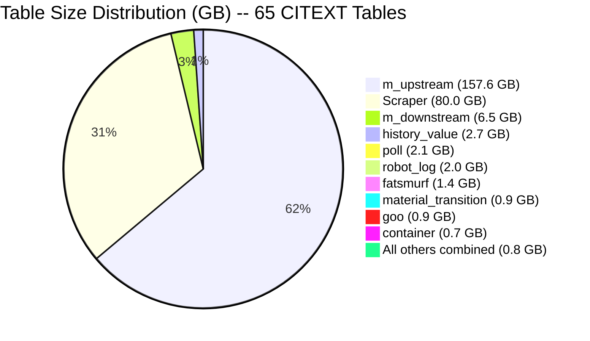

# US7 CITEXT Conversion -- Table Grouping by Volume

**User Story:** US7 -- VARCHAR/NVARCHAR to CITEXT Column Conversion
**Created:** 2026-03-17
**Source:** `docs/data-assessments/all_perseus_rowcount_table_size.csv`, `prompts/columns_citext_candidates.txt`

---

## 1. Overview

This document groups all 65 tables involved in the US7 CITEXT conversion by row volume and estimates ALTER execution times. The grouping drives the execution order: small tables first (near-instant), then large tables in ascending size order, with FK-coupled tables converted together and cache tables converted last.

**Total scope:** 65 tables, 169 columns, ranging from 0 rows to 686M rows.

---

## 2. Grouping Methodology

**Threshold: 500,000 rows** separates "large" from "small" tables.

- **Small tables (<500K rows):** ALTER TYPE is effectively instantaneous (<1 second each). These are converted first in a single batch transaction.
- **Large tables (>=500K rows):** Require careful ordering and time estimation. PostgreSQL ALTER TYPE from VARCHAR to CITEXT requires a full table rewrite when CHECK constraints, indexes, or default expressions reference the column. Even without those, a catalog-only change still needs an ACCESS EXCLUSIVE lock.
- **FK Group A:** Tables linked by foreign keys on columns being converted (material_id, transition_id) must be converted together within the same transaction to avoid FK type mismatches.
- **Cache tables:** `m_upstream`, `m_downstream`, and `m_upstream_dirty_leaves` are materialized cache tables that can be truncated and rebuilt. Converted last to minimize production impact.

---

## 3. Large Tables (>=500K rows) -- Execution Order

Ordered by table size ascending so that shorter operations run first, building confidence before the largest tables.

| Order | Table | Rows | Size (MB) | CITEXT Columns | Col Count | Group |
|-------|-------|-----:|----------:|----------------|----------:|-------|
| 1 | fatsmurf_reading | 3,816,650 | 247 | name | 1 | Regular |
| 2 | robot_log_read | 2,029,431 | 259 | source_barcode, source_position, value | 3 | Regular |
| 3 | robot_log_transfer | 1,722,005 | 335 | destination_barcode, destination_position, source_barcode, source_position, transfer_volume | 5 | Regular |
| 4 | transition_material | 5,236,136 | 468 | material_id, transition_id | 2 | FK Group A |
| 5 | container | 4,250,550 | 724 | name, position_name, position_x_coordinate, position_y_coordinate, scope_id, uid | 6 | Regular |
| 6 | goo | 5,942,387 | 880 | catalog_label, description, name, uid | 4 | FK Group A |
| 7 | material_transition | 9,002,808 | 896 | material_id, transition_id | 2 | FK Group A |
| 8 | fatsmurf | 8,034,604 | 1,426 | description, name, uid | 3 | FK Group A |
| 9 | robot_log | 3,757,415 | 1,977 | file_name, log_text, robot_log_checksum, source | 4 | Regular |
| 10 | poll | 16,757,852 | 2,111 | value | 1 | Regular |
| 11 | history_value | 45,970,857 | 2,739 | value | 1 | Regular |
| 12 | m_downstream | 33,850,871 | 6,514 | start_point, end_point, path | 3 | Cache (LAST) |
| 13 | m_upstream | 686,281,876 | 157,554 | start_point, end_point, path | 3 | Cache (VERY LAST) |

**Large table totals:** 13 tables, 38 columns, ~176 GB data.

---

## 4. Small Tables (<500K rows) -- Near-Instant ALTER

All 52 remaining tables. ALTER TYPE on these completes in under 1 second each.

| Table | Rows | Size (MB) | CITEXT Columns | Col Count |
|-------|-----:|----------:|----------------|----------:|
| Scraper | 179,054 | 80,038 | active, document_id, filename, filename_saved_as, file_type, message, received_from, result, scraper_id, scraper_message, scraper_send_to, scraping_status | 12 |
| fatsmurf_comment | 119,622 | 25 | comment | 1 |
| goo_comment | 79,965 | 18 | category, comment | 2 |
| workflow_step | 38,625 | 6 | description, label, name | 3 |
| robot_run | 33,784 | 3 | name | 1 |
| recipe_part | 24,118 | 4 | description | 1 |
| submission_entry | 9,420 | 1 | -- | 0 |
| material_inventory | 7,788 | 1 | comment | 1 |
| workflow_section | 5,141 | 0.3 | name | 1 |
| smurf_property | 5,042 | 0.3 | calculated | 1 |
| cm_user | 4,637 | 0.8 | domain_id, email, login, name | 4 |
| perseus_user | 4,536 | 0.8 | domain_id, login, mail, name | 4 |
| recipe | 4,448 | 5 | description, name, sop, sterilization_method | 4 |
| cm_user_group | 4,440 | 0.2 | -- | 0 |
| property | 2,654 | 0.2 | description, name | 2 |
| submission | 2,075 | 0.2 | label | 1 |
| field_map_display_type_user | 2,026 | 0.1 | -- | 0 |
| recipe_project_assignment | 1,909 | 0.1 | -- | 0 |
| workflow | 1,750 | 0.4 | category, description, name | 3 |
| person | 701 | 0.2 | domain_id, email, km_session_id, login, name | 5 |
| goo_type | 582 | 0.1 | abbreviation, casrn, color, iupac, name, scope_id | 6 |
| smurf | 523 | 0.1 | description, name | 2 |
| fatsmurf_attachment | 498 | 266 | attachment_mime_type, attachment_name, description | 3 |
| cm_project | 465 | 0.1 | label | 1 |
| robot_log_error | 286 | 0.1 | error_text | 1 |
| goo_attachment | 290 | 219 | attachment_mime_type, attachment_name, description | 3 |
| smurf_group_member | 250 | 0.02 | -- | 0 |
| tmp_messy_links | 230 | 0.03 | desitnation_name, destination_transition, material_id, source_name, source_transition | 5 |
| field_map_display_type | 226 | 0.1 | display | 1 |
| container_type_position | 204 | 0.03 | position_name, position_x_coordinate, position_y_coordinate | 3 |
| manufacturer | 140 | 0.02 | goo_prefix, location, name | 3 |
| cm_unit | 113 | 0.03 | description, longname, name | 3 |
| field_map | 114 | 0.04 | database_id, description, lookup, lookup_service, name, onchange, setter | 7 |
| color | 108 | 0.02 | name | 1 |
| unit | 105 | 0.02 | description, name | 2 |
| workflow_attachment | 97 | 218 | attachment_mime_type, attachment_name | 2 |
| saved_search | 85 | 0.04 | name, parameter_string | 2 |
| smurf_group | 78 | 0.02 | name | 1 |
| cm_group | 48 | 0.02 | domain_id, name | 2 |
| field_map_block | 43 | 0.02 | filter, scope | 2 |
| cm_unit_dimensions | 41 | 0.02 | name | 1 |
| migration | 41 | 0.02 | description | 1 |
| material_inventory_threshold | 40 | 0.02 | -- | 0 |
| material_inventory_threshold_notify_user | 39 | 0.02 | -- | 0 |
| field_map_set | 27 | 0.02 | color, name | 2 |
| property_option | 23 | 0.02 | label | 1 |
| external_goo_type | 22 | 0.02 | external_label | 1 |
| cm_application | 16 | 0.02 | description, jira_id, label, url | 4 |
| smurf_goo_type | 15 | 0.04 | -- | 0 |
| feed_type | 10 | 0.04 | correction_method, description, name | 3 |
| display_layout | 9 | 0.02 | name | 1 |
| field_map_type | 9 | 0.02 | name | 1 |
| history_type | 9 | 0.02 | format, name | 2 |
| workflow_step_type | 7 | 0.02 | name | 1 |
| display_type | 7 | 0.02 | name | 1 |
| sequence_type | 3 | 0.02 | name | 1 |
| goo_type_combine_target | 3 | 0.02 | -- | 0 |
| material_qc | 12 | 0.04 | entity_type_name, qc_process_uid | 2 |
| coa | 2 | 0.02 | name | 1 |
| coa_spec | 12 | 0.02 | equal_bound | 1 |
| prefix_incrementor | 2 | 0.02 | prefix | 1 |
| robot_log_type | 2 | 0.02 | name | 1 |
| goo_attachment_type | 1 | 0.02 | name | 1 |
| goo_process_queue_type | 1 | 0.02 | name | 1 |
| cm_application_group | 1 | 0.02 | label | 1 |
| Permissions | 1 | 0.02 | emailaddress, permission | 2 |
| m_upstream_dirty_leaves | 0 | 0.4 | material_uid | 1 |
| material_inventory_type | -- | -- | description, name | 2 |

**Notes:**
- Tables with Col Count = 0 appear in the CSV but have no CITEXT candidate columns. They are listed for completeness but require no action.
- `material_inventory_type` is referenced in the candidates list but does not appear in the row count CSV (may be a new or renamed table).

---

## 5. FK Group A -- Must Convert Together

These four tables are linked by foreign key relationships on `material_id` and `transition_id` columns. All must be converted within the **same transaction** to prevent FK type mismatches.

```
goo.uid  <--FK--  transition_material.material_id
goo.uid  <--FK--  material_transition.material_id
fatsmurf.uid  <--FK--  transition_material.transition_id
fatsmurf.uid  <--FK--  material_transition.transition_id
```

**Execution plan for FK Group A:**

```sql
BEGIN;
  -- Drop FK constraints first
  ALTER TABLE perseus.transition_material DROP CONSTRAINT fk_transition_material_material;
  ALTER TABLE perseus.transition_material DROP CONSTRAINT fk_transition_material_transition;
  ALTER TABLE perseus.material_transition DROP CONSTRAINT fk_material_transition_material;
  ALTER TABLE perseus.material_transition DROP CONSTRAINT fk_material_transition_transition;

  -- Convert all four tables
  ALTER TABLE perseus.transition_material ALTER COLUMN material_id TYPE citext;
  ALTER TABLE perseus.transition_material ALTER COLUMN transition_id TYPE citext;
  ALTER TABLE perseus.goo ALTER COLUMN catalog_label TYPE citext;
  ALTER TABLE perseus.goo ALTER COLUMN description TYPE citext;
  ALTER TABLE perseus.goo ALTER COLUMN name TYPE citext;
  ALTER TABLE perseus.goo ALTER COLUMN uid TYPE citext;
  ALTER TABLE perseus.material_transition ALTER COLUMN material_id TYPE citext;
  ALTER TABLE perseus.material_transition ALTER COLUMN transition_id TYPE citext;
  ALTER TABLE perseus.fatsmurf ALTER COLUMN description TYPE citext;
  ALTER TABLE perseus.fatsmurf ALTER COLUMN name TYPE citext;
  ALTER TABLE perseus.fatsmurf ALTER COLUMN uid TYPE citext;

  -- Recreate FK constraints
  ALTER TABLE perseus.transition_material ADD CONSTRAINT fk_transition_material_material ...;
  ALTER TABLE perseus.transition_material ADD CONSTRAINT fk_transition_material_transition ...;
  ALTER TABLE perseus.material_transition ADD CONSTRAINT fk_material_transition_material ...;
  ALTER TABLE perseus.material_transition ADD CONSTRAINT fk_material_transition_transition ...;
COMMIT;
```

**Combined size:** 468 + 880 + 896 + 1,426 = **3,670 MB (~3.6 GB)**
**Estimated time:** 15-25 minutes (must complete as single transaction)

---

## 6. Cache Tables -- Convert LAST

| Table | Rows | Size (MB) | CITEXT Columns | Strategy |
|-------|-----:|----------:|----------------|----------|
| m_upstream_dirty_leaves | 0 | 0.4 | material_uid | Instant (0 rows) |
| m_downstream | 33,850,871 | 6,514 | start_point, end_point, path | TRUNCATE + ALTER + rebuild |
| m_upstream | 686,281,876 | 157,554 | start_point, end_point, path | TRUNCATE + ALTER + rebuild |

**Why last:** These are cache/materialized tables populated by `reconcile_mupstream` and `reconcile_mdownstream` procedures. They can be truncated, altered (instant on empty table), and rebuilt from source data.

**Recommended strategy:**
1. TRUNCATE the cache tables (instant).
2. ALTER columns to CITEXT (instant on empty tables).
3. Rebuild cache data by running the reconciliation procedures.
4. Rebuild time for `m_upstream` depends on reconciliation procedure duration, not ALTER time.

---

## 7. Special Cases

### Scraper (179K rows, 80 GB)

Despite having only 179,054 rows, the `Scraper` table is **80 GB** due to large LOB (Large Object) columns. The 12 CITEXT candidate columns are non-LOB VARCHAR columns, so the ALTER should primarily rewrite the non-LOB portion. However, because PostgreSQL rewrites the entire tuple during ALTER TYPE, the LOB data must also be copied.

**Risk:** ALTER could take 1-4 hours depending on I/O throughput.
**Mitigation:** Schedule during maintenance window. Consider converting Scraper in its own dedicated transaction.

### m_upstream_dirty_leaves (0 rows)

Zero rows means the ALTER is a metadata-only operation completing in milliseconds. Grouped with cache tables for logical consistency but has no performance impact.

### Attachment Tables (fatsmurf_attachment, goo_attachment, workflow_attachment)

These tables have very few rows (97-498) but large sizes (218-266 MB) due to binary attachment data. The ALTER will rewrite tuples including the binary data. Estimated 1-3 minutes each despite low row counts.

---

## 8. Estimated Execution Times

Conservative estimates assuming ~1-5 min/GB for full table rewrite. Actual times depend on server I/O, concurrent load, and index/constraint complexity.

| Phase | Tables | Combined Size | Est. Time | Notes |
|-------|-------:|-------------:|-----------:|-------|
| **Phase 1: Small tables** | 52 | ~81 GB* | 2-5 min | Mostly instant; Scraper dominates |
| **Phase 1a: Scraper alone** | 1 | 80 GB | 1-4 hours | LOB rewrite; separate tx recommended |
| **Phase 1b: Other small tables** | 51 | ~1 GB | <1 min | All near-instant |
| **Phase 2: Large regular tables** | 5 | ~5,628 MB | 20-45 min | fatsmurf_reading through history_value |
| **Phase 3: FK Group A** | 4 | ~3,670 MB | 15-25 min | Single transaction required |
| **Phase 4: Cache tables** | 3 | ~164 GB | <1 min** | TRUNCATE + ALTER (instant) |
| **Phase 4a: Cache rebuild** | -- | -- | 2-8 hours | reconcile procedures repopulate |
| **TOTAL** | **65** | **~253 GB** | **~3-10 hours** | Excluding cache rebuild |

*Phase 1 size dominated by Scraper's 80 GB LOB data.
**Cache tables truncated before ALTER, so rewrite cost is zero.

### Per-Table Estimates for Large Tables

| Table | Size (MB) | Est. Time (min) | Notes |
|-------|----------:|-----------------:|-------|
| fatsmurf_reading | 247 | 1-2 | 1 column |
| robot_log_read | 259 | 1-2 | 3 columns |
| robot_log_transfer | 335 | 1-3 | 5 columns |
| transition_material | 468 | 2-4 | FK Group A |
| container | 724 | 3-6 | 6 columns |
| goo | 880 | 3-7 | FK Group A |
| material_transition | 896 | 3-7 | FK Group A |
| fatsmurf | 1,426 | 5-12 | FK Group A |
| robot_log | 1,977 | 7-16 | 4 columns, large text |
| poll | 2,111 | 7-17 | 1 column |
| history_value | 2,739 | 9-22 | 1 column, highest row count in regular |
| m_downstream | 6,514 | <1 | TRUNCATE first |
| m_upstream | 157,554 | <1 | TRUNCATE first |

---

## 9. Volume Distribution

```mermaid
gantt
    title US7 CITEXT Conversion -- Execution Timeline (Estimated)
    dateFormat HH:mm
    axisFormat %H:%M

    section Phase 1b
    Small tables (51 tables, <1 min)          :p1b, 00:00, 1m

    section Phase 1a
    Scraper (80 GB LOBs, 1-4 hrs)             :p1a, after p1b, 120m

    section Phase 2
    fatsmurf_reading (247 MB)                 :p2a, after p1a, 2m
    robot_log_read (259 MB)                   :p2b, after p2a, 2m
    robot_log_transfer (335 MB)               :p2c, after p2b, 3m
    container (724 MB)                        :p2d, after p2c, 6m
    robot_log (1.9 GB)                        :p2e, after p2d, 16m
    poll (2.1 GB)                             :p2f, after p2e, 17m
    history_value (2.7 GB)                    :p2g, after p2f, 22m

    section Phase 3
    FK Group A (3.6 GB, single tx)            :p3, after p2g, 25m

    section Phase 4
    Cache TRUNCATE + ALTER (instant)          :p4a, after p3, 1m
    Cache rebuild (reconcile procs)           :p4b, after p4a, 240m
```





---

## 10. Summary

| Metric | Value |
|--------|-------|
| Total tables | 65 |
| Total CITEXT columns | 169 |
| Small tables (<500K rows) | 52 |
| Large tables (>=500K rows) | 13 |
| FK-coupled tables | 4 (FK Group A) |
| Cache tables | 3 (m_upstream, m_downstream, m_upstream_dirty_leaves) |
| Total data volume | ~253 GB |
| Estimated ALTER time | 3-10 hours (excluding cache rebuild) |
| Estimated cache rebuild | 2-8 hours (reconciliation procedures) |
| Required maintenance window | 6-18 hours (conservative, end-to-end) |
