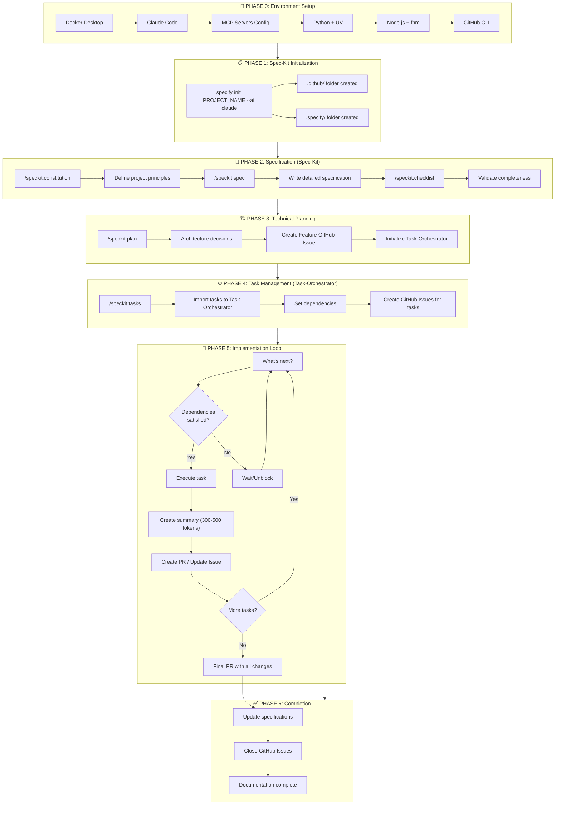

# 🚀 Development Workflow Manual: Task-Orchestrator + Spec-Kit + GitHub

**Version:** 1.0.0  
**Author:** Pierre Ribeiro  
**Date:** January 8, 2026  
**Active Personas:** 🏗️ Architect + ⚡ Backend Developer + 📚 Learning Mentor

---

## 📋 Table of Contents

1. [Overview and Philosophy](#1-overview-and-philosophy)
2. [Environment Prerequisites](#2-environment-prerequisites)
3. [Environment Setup](#3-environment-setup)
4. [Spec-Kit Workflow (Define WHAT)](#4-spec-kit-workflow-define-what)
5. [Task-Orchestrator Workflow (Execute HOW)](#5-task-orchestrator-workflow-execute-how)
6. [GitHub Integration](#6-github-integration)
7. [Case Study: Crypto Price Tracker](#7-case-study-crypto-price-tracker)
8. [Command Reference](#8-command-reference)
9. [Troubleshooting](#9-troubleshooting)

---

## 1. Overview and Philosophy

### 1.1 What is This Workflow?

This manual describes an integrated development workflow that combines three powerful tools:

| Tool | Role | Analogy |
|------|------|---------|
| **Spec-Kit** | Defines WHAT to build | The architect designing the water system |
| **Task-Orchestrator** | Manages HOW to execute | The foreman coordinating workers |
| **GitHub** | Documents everything | The inspector maintaining compliance records |

**💧 Water System Analogy (TEA-friendly):**

Think of building software like designing a water distribution system:

- **Spec-Kit** is the engineering blueprint that defines where the water comes from, where it needs to go, and what quality standards it must meet
- **Task-Orchestrator** is the construction manager who breaks the project into phases, assigns workers to each pipe section, and tracks progress
- **GitHub** is the documentation system that records every weld, every inspection, and every change for future reference

### 1.2 Why Combine These Tools?

**Problem with Traditional AI Coding ("Vibe Coding"):**
- AI produces code that compiles but misses intent
- No systematic progress tracking
- Context pollution leads to AI "forgetting" earlier decisions
- No documentation trail

**Solution with This Workflow:**
- Specification-first approach ensures AI understands intent
- Persistent memory prevents context loss (up to 90% token reduction)
- Hierarchical task management scales to 50+ tasks
- GitHub provides full traceability

### 1.3 Workflow Phases Overview

```
┌─────────────────────────────────────────────────────────────────────┐
│  PHASE 0: Environment Setup                                         │
│  Docker + Claude Code + MCP Servers + Python + Node.js + GitHub    │
└─────────────────────────────────────────────────────────────────────┘
                                    ↓
┌─────────────────────────────────────────────────────────────────────┐
│  PHASE 1: Project Initialization (Spec-Kit)                        │
│  specify init PROJECT_NAME --ai claude                             │
└─────────────────────────────────────────────────────────────────────┘
                                    ↓
┌─────────────────────────────────────────────────────────────────────┐
│  PHASE 2: Specification (Spec-Kit)                                 │
│  /speckit.constitution → /speckit.spec → /speckit.checklist        │
└─────────────────────────────────────────────────────────────────────┘
                                    ↓
┌─────────────────────────────────────────────────────────────────────┐
│  PHASE 3: Technical Planning (Spec-Kit + Task-Orchestrator)        │
│  /speckit.plan → GitHub Issue → Initialize Task-Orchestrator       │
└─────────────────────────────────────────────────────────────────────┘
                                    ↓
┌─────────────────────────────────────────────────────────────────────┐
│  PHASE 4: Task Management (Task-Orchestrator)                      │
│  /speckit.tasks → Import to Task-Orchestrator → GitHub Issues      │
└─────────────────────────────────────────────────────────────────────┘
                                    ↓
┌─────────────────────────────────────────────────────────────────────┐
│  PHASE 5: Implementation Loop (Task-Orchestrator)                  │
│  "What's next?" → Execute → Summary → PR → Repeat                  │
└─────────────────────────────────────────────────────────────────────┘
                                    ↓
┌─────────────────────────────────────────────────────────────────────┐
│  PHASE 6: Completion                                               │
│  Final PR → Update Specs → Close Issues → Documentation            │
└─────────────────────────────────────────────────────────────────────┘
```

---

## 2. Environment Prerequisites

### 2.1 Required Software

| Software | Version | Purpose |
|----------|---------|---------|
| macOS | 13.0+ (Ventura) | Operating system |
| Docker Desktop | 4.25+ | Container runtime for MCP servers |
| Claude Code | Latest | AI coding assistant |
| Python | 3.11+ | Backend development |
| UV | 0.4+ | Python package manager |
| Node.js | 20+ LTS | Frontend development |
| fnm | 1.35+ | Node.js version manager |
| Git | 2.40+ | Version control |
| GitHub CLI | 2.40+ | GitHub API interaction |

### 2.2 Required Accounts

- GitHub account with repository access
- Anthropic account for Claude Code

### 2.3 MCP Tool Servers

| Server | Purpose | Required |
|--------|---------|----------|
| Task-Orchestrator | Persistent task memory | ✅ Yes |
| GitHub MCP | Issues/PRs management | ✅ Yes |
| Filesystem MCP | File read/write | ⚠️ Recommended |
| Context7 | Library documentation | ⚠️ Recommended |
| Sequential Thinking | Complex problem solving | ⚠️ Recommended |

---

## 3. Environment Setup

### 3.1 Install Docker Desktop

```bash
# Download from https://www.docker.com/products/docker-desktop/
# Or use Homebrew:
brew install --cask docker

# Verify installation
docker --version
docker compose version

# Start Docker Desktop and ensure it's running
open -a Docker
```

**Verification:**
```bash
docker run hello-world
```

### 3.2 Install Claude Code

```bash
# Install via npm (recommended)
npm install -g @anthropic-ai/claude-code

# Or download from https://claude.ai/code

# Verify installation
claude --version
```

### 3.3 Configure MCP Servers

Create or edit the Claude Code MCP configuration:

```bash
# Location: ~/.claude/mcp.json
# Or configure via Claude CLI
```

**MCP Configuration File (~/.claude/mcp.json):**

```json
{
  "mcpServers": {
    "task-orchestrator": {
      "type": "stdio",
      "command": "docker",
      "args": [
        "run", "--rm", "-i",
        "-v", "mcp-task-data:/app/data",
        "-v", ".:/project",
        "-e", "AGENT_CONFIG_DIR=/project",
        "ghcr.io/jpicklyk/task-orchestrator:latest"
      ]
    },
    "github": {
      "type": "stdio",
      "command": "npx",
      "args": ["-y", "@modelcontextprotocol/server-github"],
      "env": {
        "GITHUB_PERSONAL_ACCESS_TOKEN": "<YOUR_GITHUB_TOKEN>"
      }
    },
    "filesystem": {
      "type": "stdio",
      "command": "npx",
      "args": ["-y", "@modelcontextprotocol/server-filesystem", "/Users/<username>/projects"]
    },
    "sequential-thinking": {
      "type": "stdio",
      "command": "npx",
      "args": ["-y", "@modelcontextprotocol/server-sequential-thinking"]
    }
  }
}
```

**Add Task-Orchestrator via CLI:**
```bash
claude mcp add-json task-orchestrator '{
  "type": "stdio",
  "command": "docker",
  "args": [
    "run", "--rm", "-i",
    "-v", "mcp-task-data:/app/data",
    "-v", ".:/project",
    "-e", "AGENT_CONFIG_DIR=/project",
    "ghcr.io/jpicklyk/task-orchestrator:latest"
  ]
}'
```

### 3.4 Install Python and UV

```bash
# Install UV (modern Python package manager)
curl -LsSf https://astral.sh/uv/install.sh | sh

# Add to PATH (add to ~/.zshrc or ~/.bashrc)
export PATH="$HOME/.local/bin:$PATH"

# Verify installation
uv --version

# Install Python via UV
uv python install 3.12
```

### 3.5 Install Node.js via fnm

```bash
# Install fnm (Fast Node Manager)
curl -fsSL https://fnm.vercel.app/install | bash

# Add to shell config (~/.zshrc or ~/.bashrc)
eval "$(fnm env --use-on-cd)"

# Install Node.js LTS
fnm install --lts
fnm use lts-latest
fnm default lts-latest

# Verify installation
node --version
npm --version
```

### 3.6 Install and Configure GitHub CLI

```bash
# Install GitHub CLI
brew install gh

# Authenticate with GitHub
gh auth login

# Select: GitHub.com → HTTPS → Login with browser

# Verify authentication
gh auth status
```

### 3.7 Install Spec-Kit CLI (specify)

```bash
# Install specify CLI via UV
uvx --from git+https://github.com/github/spec-kit.git specify --version

# Or install as tool
uv tool install specify-cli --from git+https://github.com/github/spec-kit.git

# Verify installation
specify --version
```

### 3.8 Verify Complete Setup

```bash
# Run verification script
echo "=== Environment Verification ==="
echo "Docker: $(docker --version)"
echo "Claude: $(claude --version 2>/dev/null || echo 'Check manually')"
echo "UV: $(uv --version)"
echo "Python: $(python3 --version)"
echo "Node: $(node --version)"
echo "npm: $(npm --version)"
echo "Git: $(git --version)"
echo "GitHub CLI: $(gh --version | head -1)"
echo "Specify: $(specify --version 2>/dev/null || echo 'Check manually')"
echo "=== Verification Complete ==="
```

---

## 4. Spec-Kit Workflow (Define WHAT)

### 4.1 Phase 1: Project Initialization

**Purpose:** Create the project scaffold with Spec-Kit folders and agent configuration.

```bash
# Navigate to your projects directory
cd ~/projects

# Initialize new project with specify CLI
specify init crypto-price-tracker --ai claude

# Or initialize in existing directory
cd existing-project
specify init . --ai claude
```

**What Gets Created:**

```
crypto-price-tracker/
├── .github/
│   └── prompts/           # Agent prompts and commands
│       ├── speckit.constitution.md
│       ├── speckit.spec.md
│       ├── speckit.checklist.md
│       ├── speckit.plan.md
│       ├── speckit.tasks.md
│       ├── speckit.implement.md
│       └── speckit.iterate.md
├── .specify/
│   ├── specs/             # Specification documents
│   ├── plans/             # Technical plans
│   ├── tasks/             # Task breakdowns
│   └── scripts/           # Automation scripts
├── .gitignore
└── README.md
```

**Initialize Git and Create Remote Repository:**

```bash
cd crypto-price-tracker

# Initialize Git repository
git init

# Create GitHub repository
gh repo create crypto-price-tracker --public --source=. --remote=origin

# Initial commit
git add .
git commit -m "chore: initialize project with Spec-Kit"
git push -u origin main
```

### 4.2 Phase 2: Create Constitution

**Purpose:** Define non-negotiable project principles that guide all development.

**Open Claude Code in the project:**
```bash
cd crypto-price-tracker
claude
```

**In Claude Code, use the constitution command:**
```
/speckit.constitution

Create a modern cryptocurrency price tracking application.

Core Principles:
1. **Security-First**: All API keys must be stored in environment variables, never in code
2. **Type Safety**: Use TypeScript for frontend, type hints for Python backend
3. **API Reliability**: Implement rate limiting and caching for external API calls
4. **Mobile-First Design**: Responsive UI that works on all devices
5. **Real-Time Updates**: Prices should refresh automatically without manual intervention
6. **Error Resilience**: Graceful degradation when external services are unavailable
7. **Clean Architecture**: Separation of concerns between data, business logic, and presentation
```

**Output:** Creates `.specify/constitution.md`

### 4.3 Phase 2: Write Specification

**Purpose:** Detailed description of features, user flows, and requirements.

```
/speckit.spec

Develop "CryptoTracker Pro" - a cryptocurrency price tracking application.

## Overview
A web application that displays live cryptocurrency prices, tracks trends, 
and helps users discover top gainers in the market.

## Target Users
- Crypto enthusiasts monitoring their portfolio
- Day traders looking for market movements
- Beginners learning about cryptocurrency

## Core Features

### 1. Price Dashboard
- Display top 20 cryptocurrencies by market cap
- Show current price in USD
- Display 24h price change (percentage and absolute)
- Visual indicators (green/red) for price direction
- Market cap and trading volume

### 2. Top Gainers/Losers
- Ranked list of best performing coins (24h)
- Ranked list of worst performing coins (24h)
- Percentage change prominently displayed

### 3. Search & Filter
- Search cryptocurrencies by name or symbol
- Filter by price range
- Filter by market cap category (large/mid/small)

### 4. Price Charts
- Simple sparkline charts showing 7-day trend
- Click to expand for detailed chart view

### 5. Real-Time Updates
- Auto-refresh every 30 seconds
- Manual refresh button
- Last updated timestamp display

## Technical Requirements

### Data Source
- CoinGecko API (free tier)
- Fallback to CoinMarketCap if available

### Performance
- Initial load < 2 seconds
- Price updates < 500ms perceived latency
- Support 100+ concurrent users

### Browser Support
- Chrome, Firefox, Safari, Edge (latest 2 versions)
- Mobile browsers (iOS Safari, Chrome Android)
```

**Output:** Creates `.specify/specs/001-crypto-tracker.md`

### 4.4 Phase 2: Validate with Checklist

**Purpose:** Ensure specification is complete before planning.

```
/speckit.checklist

Review the specification for completeness.
```

**Claude will verify:**
- ✅ Clear problem statement
- ✅ Defined user personas
- ✅ Feature list with acceptance criteria
- ✅ Technical constraints specified
- ✅ Performance requirements defined
- ✅ Security considerations addressed
- ✅ Edge cases documented

### 4.5 Phase 3: Create Technical Plan

**Purpose:** Define architecture, technology choices, and implementation approach.

```
/speckit.plan

Technology Stack:
- **Frontend**: React 18 + TypeScript + Tailwind CSS + Vite
- **Backend**: Python 3.12 + FastAPI + UV
- **Data Source**: CoinGecko API
- **Caching**: Redis (optional, in-memory for MVP)
- **Deployment**: Docker Compose for local development

Architecture:
- Monorepo with frontend/ and backend/ directories
- RESTful API with JSON responses
- Frontend polling for updates (WebSocket as enhancement)

API Endpoints:
- GET /api/prices - List all tracked cryptocurrencies
- GET /api/prices/{symbol} - Get single cryptocurrency details
- GET /api/gainers - Top 10 gainers
- GET /api/losers - Top 10 losers
- GET /api/search?q={query} - Search cryptocurrencies
```

**Output:** Creates `.specify/plans/001-technical-plan.md`

---

## 5. Task-Orchestrator Workflow (Execute HOW)

### 5.1 Phase 3: Initialize Task-Orchestrator

**Purpose:** Connect the specification to Task-Orchestrator's persistent memory.

**In Claude Code:**
```
Run the initialize_task_orchestrator workflow
```

This writes Task-Orchestrator patterns to CLAUDE.md for persistent memory.

**Setup Project in Task-Orchestrator:**
```
Run setup_project to initialize Task-Orchestrator for CryptoTracker Pro
```

### 5.2 Phase 3: Create Feature in Task-Orchestrator

**Create the main feature from specification:**

```
Create a new feature in Task-Orchestrator:

Feature Name: Core Crypto Price Tracker
Description: Implementation of the main cryptocurrency price tracking 
dashboard with live prices, gainers/losers, and search functionality.

Reference: .specify/specs/001-crypto-tracker.md
Technical Plan: .specify/plans/001-technical-plan.md
```

**Task-Orchestrator will create:**
- Project: CryptoTracker Pro
- Feature: Core Crypto Price Tracker
- Status: PLANNING

### 5.3 Phase 4: Generate Tasks

**In Claude Code:**
```
/speckit.tasks

Break down the technical plan into implementation tasks.
Ensure each task is:
- Small enough to complete in 1-2 hours
- Has clear acceptance criteria
- Specifies dependencies on other tasks
```

**Import Tasks to Task-Orchestrator:**

```
Import these tasks to Task-Orchestrator for the "Core Crypto Price Tracker" feature:

Task 1: Project Structure Setup
- Create monorepo structure with frontend/ and backend/ directories
- Initialize package.json and pyproject.toml
- Setup Docker Compose for development
- Dependencies: None

Task 2: Backend - CoinGecko API Integration
- Create service class for CoinGecko API
- Implement rate limiting (30 calls/minute)
- Add response caching (60 seconds TTL)
- Dependencies: Task 1

Task 3: Backend - FastAPI Endpoints
- Create /api/prices endpoint
- Create /api/gainers and /api/losers endpoints
- Create /api/search endpoint
- Add error handling and validation
- Dependencies: Task 2

Task 4: Frontend - React Project Setup
- Initialize Vite + React + TypeScript
- Configure Tailwind CSS
- Setup project structure (components, hooks, services)
- Dependencies: Task 1

Task 5: Frontend - API Client Service
- Create typed API client with fetch
- Implement error handling
- Add loading states
- Dependencies: Task 3, Task 4

Task 6: Frontend - Price Card Component
- Create reusable PriceCard component
- Display symbol, price, 24h change
- Color coding for gains/losses
- Dependencies: Task 4

Task 7: Frontend - Dashboard Layout
- Create responsive grid layout
- Implement header with search
- Add refresh button and timestamp
- Dependencies: Task 6

Task 8: Frontend - Gainers/Losers Section
- Create tabbed component for gainers/losers
- Implement ranking display
- Add sorting functionality
- Dependencies: Task 5, Task 6

Task 9: Frontend - Search Functionality
- Implement search input with debounce
- Create search results dropdown
- Handle empty states
- Dependencies: Task 5, Task 7

Task 10: Integration & Testing
- Connect frontend to backend
- Write unit tests for API service
- Write component tests for key components
- End-to-end smoke test
- Dependencies: Task 3, Task 5, Task 8, Task 9

Task 11: Documentation
- Update README with setup instructions
- Document API endpoints
- Add architecture diagram
- Dependencies: Task 10
```

### 5.4 Phase 4: Set Dependencies in Task-Orchestrator

Task-Orchestrator automatically tracks dependencies. Verify with:

```
Show me the task dependency graph for "Core Crypto Price Tracker"
```

**Expected Output:**
```
Task Dependency Graph:

Task 1: Project Structure Setup [NO DEPENDENCIES]
  ↳ Task 2: CoinGecko API Integration
  ↳ Task 4: React Project Setup

Task 2: CoinGecko API Integration
  ↳ Task 3: FastAPI Endpoints

Task 4: React Project Setup
  ↳ Task 5: API Client Service (also requires Task 3)
  ↳ Task 6: Price Card Component

Task 6: Price Card Component
  ↳ Task 7: Dashboard Layout
  ↳ Task 8: Gainers/Losers Section (also requires Task 5)

Task 7: Dashboard Layout
  ↳ Task 9: Search Functionality (also requires Task 5)

Task 3, 5, 8, 9 → Task 10: Integration & Testing
Task 10 → Task 11: Documentation
```

### 5.5 Phase 5: Implementation Loop

This is the core execution pattern. Repeat until all tasks complete:

**Step 1: Ask What's Next**
```
What's next?
```

Task-Orchestrator responds with the next unblocked task:
```
Task 1: Project Structure Setup [PENDING] [NO BLOCKERS]

Acceptance Criteria:
- Monorepo with frontend/ and backend/ directories
- package.json with workspace configuration
- pyproject.toml for backend
- docker-compose.yml for development

Shall I proceed with implementation?
```

**Step 2: Execute the Task**
```
Yes, proceed with Task 1
```

Claude implements the task, creating files and making changes.

**Step 3: Create Summary**

After implementation, Task-Orchestrator creates a summary (300-500 tokens):

```
### Task 1 Summary

**Completed:**
Created monorepo structure with frontend/ (Vite + React + TypeScript) 
and backend/ (FastAPI + Python 3.12) directories.

**Files Created:**
- package.json (workspace config)
- backend/pyproject.toml (UV project)
- docker-compose.yml (Postgres + Redis + services)
- frontend/package.json
- backend/src/__init__.py

**Technical Decisions:**
- Using npm workspaces for monorepo management
- UV for Python dependency management
- Docker Compose with hot-reload for development

**Ready For:**
Task 2 (CoinGecko integration) and Task 4 (React setup) are now unblocked
```

**Step 4: Create Pull Request**

See GitHub Integration section for PR creation.

**Step 5: Repeat**

```
What's next?
```

Continue until all tasks complete.

---

## 6. GitHub Integration

### 6.1 Create Feature Branch

At the start of implementation:

```bash
# Create feature branch
git checkout -b feature/001-crypto-tracker

# Push branch to remote
git push -u origin feature/001-crypto-tracker
```

### 6.2 Create GitHub Issue for Feature

**Via GitHub CLI:**
```bash
gh issue create \
  --title "Feature: Core Crypto Price Tracker" \
  --body "$(cat .specify/specs/001-crypto-tracker.md)" \
  --label "feature,epic"
```

**Via Claude Code with GitHub MCP:**
```
Create a GitHub issue for the "Core Crypto Price Tracker" feature.

Title: Feature: Core Crypto Price Tracker
Labels: feature, epic
Body: Include the specification from .specify/specs/001-crypto-tracker.md
Milestone: v1.0.0
```

### 6.3 Create GitHub Issues for Tasks

**Batch create issues for all tasks:**

```
Create GitHub issues for all tasks in "Core Crypto Price Tracker":

For each task:
- Title: "Task X: {task_name}"
- Label: "task"
- Reference the parent feature issue
- Include acceptance criteria in body
- Set dependencies in description
```

**Expected Issues Created:**
- #2: Task 1: Project Structure Setup
- #3: Task 2: Backend - CoinGecko API Integration
- #4: Task 3: Backend - FastAPI Endpoints
- #5: Task 4: Frontend - React Project Setup
- ...and so on

### 6.4 Link PRs to Issues

After completing each task, create a PR that references the issue:

```bash
# After completing Task 1
git add .
git commit -m "feat: create project structure

- Add monorepo with frontend/ and backend/
- Configure package.json workspaces
- Setup docker-compose.yml

Closes #2"

git push
```

**Create PR via GitHub CLI:**
```bash
gh pr create \
  --title "feat: create project structure" \
  --body "Implements task 1 of the Crypto Price Tracker feature.

## Changes
- Monorepo structure with workspaces
- Docker Compose for development
- Initial project configuration

## Checklist
- [x] Frontend directory created
- [x] Backend directory created
- [x] Docker Compose configured
- [x] Documentation updated

Closes #2
Related to #1" \
  --label "task"
```

**Via Claude Code:**
```
Create a pull request for the completed Task 1.
Link it to issue #2.
Include a summary of changes and checklist.
```

### 6.5 PR Template

Create `.github/pull_request_template.md`:

```markdown
## Summary
<!-- Brief description of changes -->

## Task Reference
<!-- Link to Task-Orchestrator task and GitHub issue -->
- Task: 
- Issue: Closes #

## Changes Made
<!-- List of specific changes -->
- 
- 
- 

## Checklist
- [ ] Code follows project style guidelines
- [ ] Tests added/updated
- [ ] Documentation updated
- [ ] Task-Orchestrator summary created

## Screenshots
<!-- If applicable -->

## Testing Instructions
<!-- How to verify the changes -->
```

### 6.6 Close Issues on Completion

When all tasks are complete:

```bash
# Final PR merges automatically close linked issues
# Or manually close the feature issue

gh issue close 1 --comment "Feature complete! All tasks implemented and merged."
```

---

## 7. Case Study: Crypto Price Tracker

### 7.1 Complete Walkthrough

This section provides a complete, real-world walkthrough of building the Crypto Price Tracker using the integrated workflow.

#### Day 1: Setup and Specification

**Morning: Environment Setup (30 minutes)**

```bash
# 1. Verify environment
docker --version && node --version && python3 --version && gh auth status

# 2. Create project
cd ~/projects
specify init crypto-price-tracker --ai claude
cd crypto-price-tracker

# 3. Initialize Git and GitHub
git init
gh repo create crypto-price-tracker --public --source=. --remote=origin
git add . && git commit -m "chore: initialize project" && git push -u origin main

# 4. Open Claude Code
claude
```

**Morning: Constitution and Specification (1 hour)**

In Claude Code:
```
/speckit.constitution

Crypto Price Tracker Application

Principles:
1. Security-First: Environment variables for secrets
2. Type Safety: TypeScript + Python type hints
3. API Reliability: Rate limiting and caching
4. Mobile-First: Responsive design
5. Real-Time: Auto-refresh capabilities
6. Clean Architecture: Separation of concerns
```

```
/speckit.spec

[Full specification as shown in Section 4.3]
```

```
/speckit.checklist
```

**Afternoon: Technical Planning (1 hour)**

```
/speckit.plan

[Full technical plan as shown in Section 4.5]
```

**Afternoon: Task-Orchestrator Setup (30 minutes)**

```
Run setup_project to initialize Task-Orchestrator for CryptoTracker Pro
```

```
Create feature: Core Crypto Price Tracker
[Import all 11 tasks as shown in Section 5.3]
```

**End of Day 1: GitHub Setup**

```bash
# Create feature branch
git checkout -b feature/001-crypto-tracker
git push -u origin feature/001-crypto-tracker

# Create GitHub issues
gh issue create --title "Epic: Core Crypto Price Tracker" --label "epic" --body "..."
# Create task issues (or via Claude Code with GitHub MCP)
```

#### Day 2: Implementation

**Task 1: Project Structure (45 minutes)**

```
What's next?
```

```
Proceed with Task 1: Project Structure Setup
```

After completion:
```bash
git add .
git commit -m "feat: create monorepo structure

- frontend/ with Vite + React + TypeScript
- backend/ with FastAPI + Python 3.12
- docker-compose.yml for development

Closes #2"

git push
gh pr create --title "feat: create project structure" --body "..."
```

**Task 2: CoinGecko Integration (1 hour)**

```
What's next?
```

```
Proceed with Task 2: Backend - CoinGecko API Integration
```

Claude creates:
- `backend/src/services/coingecko.py`
- `backend/src/models/crypto.py`
- Rate limiting with `asyncio.Semaphore`
- In-memory caching with TTL

```bash
git add .
git commit -m "feat: add CoinGecko API integration

- CoinGeckoService with rate limiting
- Response caching (60s TTL)
- Typed models for API responses

Closes #3"

git push
gh pr create ...
```

**Continue pattern for remaining tasks...**

#### Day 3-4: Frontend Implementation

**Tasks 4-9: Frontend Development**

Each task follows the same pattern:
1. `What's next?`
2. Claude implements
3. Task-Orchestrator creates summary
4. Commit and PR

#### Day 5: Integration and Documentation

**Task 10: Integration & Testing**

```
What's next?
```

```
Proceed with Task 10: Integration & Testing

Connect the frontend to the backend, verify all endpoints work,
and add tests for critical paths.
```

**Task 11: Documentation**

```
What's next?
```

```
Proceed with Task 11: Documentation

Update README with:
- Project overview
- Setup instructions
- API documentation
- Architecture diagram
```

### 7.2 Final Project Structure

```
crypto-price-tracker/
├── .github/
│   ├── prompts/             # Spec-Kit commands
│   └── pull_request_template.md
├── .specify/
│   ├── specs/
│   │   └── 001-crypto-tracker.md
│   ├── plans/
│   │   └── 001-technical-plan.md
│   └── constitution.md
├── .taskorchestrator/       # Task-Orchestrator config
│   ├── config.yaml
│   └── agent-mapping.yaml
├── backend/
│   ├── src/
│   │   ├── __init__.py
│   │   ├── main.py
│   │   ├── models/
│   │   │   └── crypto.py
│   │   ├── services/
│   │   │   └── coingecko.py
│   │   └── routers/
│   │       └── prices.py
│   ├── tests/
│   ├── pyproject.toml
│   └── Dockerfile
├── frontend/
│   ├── src/
│   │   ├── App.tsx
│   │   ├── components/
│   │   │   ├── PriceCard.tsx
│   │   │   ├── Dashboard.tsx
│   │   │   ├── GainersLosers.tsx
│   │   │   └── SearchBar.tsx
│   │   ├── hooks/
│   │   │   └── usePrices.ts
│   │   ├── services/
│   │   │   └── api.ts
│   │   └── types/
│   │       └── crypto.ts
│   ├── package.json
│   └── Dockerfile
├── docker-compose.yml
├── package.json             # Workspace root
└── README.md
```

### 7.3 Key Code Examples

**Backend: CoinGecko Service**

```python
# backend/src/services/coingecko.py
from dataclasses import dataclass
from datetime import datetime, timedelta
from typing import Optional
import asyncio
import httpx

@dataclass
class CryptoPrice:
    """Cryptocurrency price data."""
    id: str
    symbol: str
    name: str
    current_price: float
    price_change_24h: float
    price_change_percentage_24h: float
    market_cap: int
    total_volume: int

class CoinGeckoService:
    """Service for fetching cryptocurrency data from CoinGecko API."""
    
    BASE_URL = "https://api.coingecko.com/api/v3"
    RATE_LIMIT = 30  # calls per minute
    CACHE_TTL = 60   # seconds
    
    def __init__(self) -> None:
        self._semaphore = asyncio.Semaphore(self.RATE_LIMIT)
        self._cache: dict[str, tuple[list[CryptoPrice], datetime]] = {}
    
    async def get_prices(self, limit: int = 20) -> list[CryptoPrice]:
        """Fetch top cryptocurrencies by market cap."""
        cache_key = f"prices_{limit}"
        
        # Check cache
        if cache_key in self._cache:
            data, timestamp = self._cache[cache_key]
            if datetime.now() - timestamp < timedelta(seconds=self.CACHE_TTL):
                return data
        
        # Fetch from API
        async with self._semaphore:
            async with httpx.AsyncClient() as client:
                response = await client.get(
                    f"{self.BASE_URL}/coins/markets",
                    params={
                        "vs_currency": "usd",
                        "order": "market_cap_desc",
                        "per_page": limit,
                        "page": 1,
                    }
                )
                response.raise_for_status()
                data = [CryptoPrice(**coin) for coin in response.json()]
        
        # Update cache
        self._cache[cache_key] = (data, datetime.now())
        return data
```

**Frontend: Price Card Component**

```tsx
// frontend/src/components/PriceCard.tsx
import { type FC } from 'react';
import { CryptoPrice } from '../types/crypto';

interface PriceCardProps {
  crypto: CryptoPrice;
}

export const PriceCard: FC<PriceCardProps> = ({ crypto }) => {
  const isPositive = crypto.price_change_percentage_24h >= 0;
  
  return (
    <div className="bg-white rounded-lg shadow-md p-4 hover:shadow-lg transition-shadow">
      <div className="flex items-center justify-between">
        <div className="flex items-center gap-3">
          <span className="text-2xl font-bold uppercase">{crypto.symbol}</span>
          <span className="text-gray-500">{crypto.name}</span>
        </div>
        <div className="text-right">
          <div className="text-xl font-semibold">
            ${crypto.current_price.toLocaleString()}
          </div>
          <div className={`text-sm font-medium ${isPositive ? 'text-green-600' : 'text-red-600'}`}>
            {isPositive ? '+' : ''}{crypto.price_change_percentage_24h.toFixed(2)}%
          </div>
        </div>
      </div>
      <div className="mt-2 text-sm text-gray-400">
        Market Cap: ${(crypto.market_cap / 1e9).toFixed(2)}B
      </div>
    </div>
  );
};
```

---

## 8. Command Reference

### 8.1 Spec-Kit Commands

| Command | Purpose | Phase |
|---------|---------|-------|
| `specify init PROJECT --ai claude` | Initialize project | 1 |
| `/speckit.constitution` | Define project principles | 2 |
| `/speckit.spec` | Write feature specification | 2 |
| `/speckit.checklist` | Validate specification | 2 |
| `/speckit.plan` | Create technical plan | 3 |
| `/speckit.tasks` | Generate implementation tasks | 4 |
| `/speckit.implement` | Execute implementation | 5 |
| `/speckit.iterate` | Refine and improve | 6 |

### 8.2 Task-Orchestrator Commands

| Command | Purpose |
|---------|---------|
| `setup_project` | Initialize Task-Orchestrator |
| `initialize_task_orchestrator` | Write patterns to CLAUDE.md |
| `getting_started` | Show quick reference guide |
| `What's next?` | Get next unblocked task |
| `coordinate_feature_development` | Full feature orchestration |

### 8.3 GitHub CLI Commands

| Command | Purpose |
|---------|---------|
| `gh repo create NAME` | Create repository |
| `gh issue create` | Create issue |
| `gh issue list` | List issues |
| `gh issue close N` | Close issue |
| `gh pr create` | Create pull request |
| `gh pr merge N` | Merge pull request |
| `gh pr list` | List pull requests |

### 8.4 Development Commands

```bash
# Start development environment
docker compose up -d

# Backend development
cd backend
uv run uvicorn src.main:app --reload

# Frontend development
cd frontend
npm run dev

# Run tests
cd backend && uv run pytest
cd frontend && npm test
```

---

## 9. Troubleshooting

### 9.1 MCP Server Issues

**Problem:** Task-Orchestrator tools not found

**Solution:**
```bash
# Restart Claude Code
# Verify Docker is running
docker ps

# Check MCP configuration
cat ~/.claude/mcp.json

# Pull latest image
docker pull ghcr.io/jpicklyk/task-orchestrator:latest
```

**Problem:** GitHub MCP authentication failed

**Solution:**
```bash
# Regenerate GitHub token
gh auth refresh

# Update token in MCP config
# Token needs: repo, read:org, read:user scopes
```

### 9.2 Spec-Kit Issues

**Problem:** `specify` command not found

**Solution:**
```bash
# Reinstall via UV
uv tool install specify-cli --from git+https://github.com/github/spec-kit.git --force

# Or use uvx directly
uvx --from git+https://github.com/github/spec-kit.git specify init .
```

**Problem:** Slash commands not working in Claude

**Solution:**
- Ensure you're in the project directory
- Verify `.github/prompts/` folder exists
- Restart Claude Code

### 9.3 Docker Issues

**Problem:** Docker containers not starting

**Solution:**
```bash
# Check Docker Desktop is running
open -a Docker

# Clean up and restart
docker compose down -v
docker compose up -d --build

# Check logs
docker compose logs -f
```

### 9.4 Common Workflow Issues

**Problem:** Tasks not appearing in Task-Orchestrator

**Solution:**
- Verify `setup_project` was run
- Check Docker volume for data persistence:
  ```bash
  docker volume inspect mcp-task-data
  ```

**Problem:** Context pollution / AI forgetting decisions

**Solution:**
- Ensure summaries are being created (300-500 tokens)
- Use `What's next?` pattern consistently
- Don't add unnecessary context to messages

---

## Appendix A: Workflow Diagram (Mermaid)



---

## Appendix B: MCP Configuration Templates

### Full Configuration (~/.claude/mcp.json)

```json
{
  "mcpServers": {
    "task-orchestrator": {
      "type": "stdio",
      "command": "docker",
      "args": [
        "run", "--rm", "-i",
        "-v", "mcp-task-data:/app/data",
        "-v", ".:/project",
        "-e", "AGENT_CONFIG_DIR=/project",
        "ghcr.io/jpicklyk/task-orchestrator:latest"
      ]
    },
    "github": {
      "type": "stdio",
      "command": "npx",
      "args": ["-y", "@modelcontextprotocol/server-github"],
      "env": {
        "GITHUB_PERSONAL_ACCESS_TOKEN": "${GITHUB_TOKEN}"
      }
    },
    "filesystem": {
      "type": "stdio",
      "command": "npx",
      "args": [
        "-y", "@modelcontextprotocol/server-filesystem",
        "${HOME}/projects"
      ]
    },
    "sequential-thinking": {
      "type": "stdio",
      "command": "npx",
      "args": ["-y", "@modelcontextprotocol/server-sequential-thinking"]
    },
    "memory": {
      "type": "stdio",
      "command": "npx",
      "args": ["-y", "@modelcontextprotocol/server-memory"]
    }
  }
}
```

---

## Appendix C: GitHub Token Setup

1. Go to GitHub Settings → Developer Settings → Personal Access Tokens → Fine-grained tokens

2. Create new token with permissions:
   - Repository access: All repositories (or select specific)
   - Permissions:
     - Contents: Read and write
     - Issues: Read and write
     - Pull requests: Read and write
     - Metadata: Read-only

3. Copy token and add to environment:
   ```bash
   export GITHUB_TOKEN="your_token_here"
   ```

4. Add to shell profile (~/.zshrc or ~/.bashrc):
   ```bash
   echo 'export GITHUB_TOKEN="your_token_here"' >> ~/.zshrc
   ```

---

**End of Manual**

*Version 1.0.0 - January 8, 2026*
*Created for: Pierre Ribeiro*
*Workflow: @Architecture for@ + @Backend dev@ + @Teach me@*
